

# **Universidad Peruana de Ciencias Aplicadas**
## **Ingeniería de Software**

**Periodo:** 2025-20  
**Curso:** 1ASI0729 – Desarrollo de Aplicaciones Open Source
**NRC:** 7369  
**Docente:** Wilder Julio Espinoza Bravo

---

## **Informe del Trabajo Final**

**Startup:** MatchPoint  
**Producto:** MatchPoint  

---
### **Integrantes**

U20211584 - Angulo Abad, Juan Carlos

U20211837 - Jonseck Choque, Oliver 

U20213278 - Durand Vega, Gianfranco

U20213322 - Mio Mejía, Andy Alejandro

U20214011 - Murillo, Mathias Javier

**Octubre 2025**

# Registro de Versiones del Informe

| Versión | Fecha | Autor | Descripción de modificación |
| :-------: | :---------: | :----------------: | :----------------------:|
|TB1|02/09/25|Javier Murillo, Mathias|Se añadió los capítulos 1 al 5|
|TP1|08/10/25|Vega Durand, Gianfranco|Se añadió el sprint 2 y se arreglaron diversos capítulos|
|TB2|11/11/25| Murillo, Mathias Javier|Se añadió el sprint 3|
|TF1|04/12/25|Jonseck Choque, Oliver|Se añadió el sprint 4, video about the product, video about the team y se corrigieron diversos capítulos|

# Project Report Collaboration Insights

A lo largo del desarrollo del trabajo, se ha evidenciado una participación activa, coordinada y progresiva por parte de todos los integrantes del equipo. Cada fase fue abordada de manera estructurada, siguiendo las buenas prácticas de trabajo colaborativo con control de versiones en GitHub, planificación por entregables, y asignación clara de responsabilidades según las competencias de cada integrante.

El uso de repositorios específicos por subcomponente también contribuyó a mantener una mejor trazabilidad del trabajo colaborativo, integrando ramas por entregables y controlando versiones según el avance de cada sprint.

A continuación, se detallan los repositorios utilizados a lo largo del proyecto:

#### Link del repositorio del Reporte: [https://github.com/AplicacionesOpenSource-Grupo1/upc-pre-202520--1asi0729-7369-MatchPoint-report](https://github.com/AplicacionesOpenSource-Grupo1/upc-pre-202520--1asi0729-7369-MatchPoint-report)

#### Link del repositorio de la Landing Page: [https://github.com/AplicacionesOpenSource-Grupo1/upc-pre-202520--1asi0729-7369-MatchPoint-Landing-Page](https://github.com/AplicacionesOpenSource-Grupo1/upc-pre-202520--1asi0729-7369-MatchPoint-Landing-Page)

#### Link del repositorio del frontEnd [https://github.com/AplicacionesOpenSource-Grupo1/upc-pre-202520--1asi0729-7369-MatchPoint-frontend](https://github.com/AplicacionesOpenSource-Grupo1/upc-pre-202520--1asi0729-7369-MatchPoint-frontend)

#### Link del repositorio del BackEnd [https://github.com/AplicacionesOpenSource-Grupo1/upc-pre-202520--1asi0729-7369-MatchPoint-backend](https://github.com/AplicacionesOpenSource-Grupo1/upc-pre-202520--1asi0729-7369-MatchPoint-backend)

#### Link a la pagina FrontEnd [https://matchpoint-front.web.app/dashboard](https://matchpoint-front.web.app/dashboard)

# Contenido

## Tabla de Contenidos

[Registro de versiones del informe](#registro-de-versiones-del-informe)

[Project Report Collaboration Insights](#project-report-collaboration-insights)

[Contenido](#contenido)

[Student Outcome](#student-outcome-1)

[Capítulo I: Introducción](#capitulo-i-introduccion)

- [1.1. Startup Profile](#11-startup-profile)

  - [1.1.1. Descripción de la Startup](#111-description-de-la-startup)

  - [1.1.2. Perfiles de integrantes del equipo](#112-perfiles-de-integrantes-del-equipo)

- [1.2. Solution Profile](#12-solution-profile)
  - [1.2.1 Antecedentes y problemática](#121-antecedentes-y-problemática)
  - [1.2.2 Lean UX Process](#122-lean-ux-process)
    - [1.2.2.1. Lean UX Problem Statements](#1221-lean-ux-problem-statements)
    - [1.2.2.2. Lean UX Assumptions](#1222-lean-ux-assumptions)
    - [1.2.2.3. Lean UX Hypothesis Statements](#1223-lean-ux-hypothesis-statements)
    - [1.2.2.4. Lean UX Canvas](#1224-lean-ux-canvas)
- [1.3. Segmentos objetivo](#13-segmentos-objetivo)

[Capítulo II: Requirements Elicitation & Analysis](#capítulo-ii-requirements-elicitation--analysis-1)

- [2.1. Competidores](#21-competidores)
  - [2.1.1. Análisis competitivo](#211-análisis-competitivo)
  - [2.1.2. Estrategias y tácticas frente a competidores](#212-estrategias-y-tácticas-frente-a-competidores)
- [2.2. Entrevistas](#22-entrevistas)
  - [2.2.1. Diseño de entrevistas](#221-diseño-de-entrevistas)
  - [2.2.2. Registro de entrevistas](#222-registro-de-entrevistas)
  - [2.2.3. Análisis de entrevistas](#223-análisis-de-entrevistas)
- [2.3. Needfinding](#23-needfinding)
  - [2.3.1. User Personas](#231-user-personas)
  - [2.3.2. User Task Matrix](#232-user-task-matrix)
  - [2.3.3. User Journey Mapping](#233-user-journey-mapping)
  - [2.3.4. Empathy Mapping](#234-empathy-mapping)
  - [2.3.5. As-is Scenario Mapping](#235-as-is-scenario-mapping)

[Capítulo III: Requirements Specification](#capítulo-iii-requirements-specification-1)

- [3.1. To-Be Scenario Mapping](#31-to-be-scenario-mapping)
- [3.2. User Stories](#32-user-stories)
- [3.3. Impact Mapping](#33-impact-mapping)
- [3.4. Product Backlog](#34-product-backlog)

[Capítulo IV: Product Design](#capitulo-iv-product-design-1)

- [4.1. Style Guidelines](#41-style-guidelines)
  - [4.1.1. General Style Guidelines](#411-general-style-guidelines)
  - [4.1.2. Web Style Guidelines](#412-web-style-guidelines)
- [4.2. Information Architecture](#42-information-architecture)
  - [4.2.1. Organization Systems](#421-organization-systems)
  - [4.2.2. Labeling Systems](#422-labeling-systems)
  - [4.2.3. SEO Tags and Meta Tags](#423-seo-tags-and-meta-tags)
  - [4.2.4. Searching Systems](#424-searching-systems)
  - [4.2.5. Navigation Systems](#425-navigation-systems)
- [4.3. Landing Page UI Design](#43-landing-page-ui-design)
  - [4.3.1. Landing Page Wireframe](#431-landing-page-wireframe)
  - [4.3.2. Landing Page Mock-up](#432-landing-page-mock-up)
- [4.4. Web Applications UX/UI Design](#44-web-applications-uxui-design)
  - [4.4.1. Web Applications Wireframes](#441-web-applications-wireframes)
  - [4.4.2. Web Applications Wireflow Diagrams](#442-web-applications-wireflow-diagrams)
  - [4.4.3. Web Applications Mock-ups](#443-web-applications-mock-ups)
  - [4.4.4. Web Applications User Flow Diagrams](#444-web-applications-user-flow-diagrams)
- [4.5. Web Applications Prototyping](#45-web-applications-prototyping)
- [4.6. Domain-Driven Software Architecture](#46-domain-driven-software-architecture)
  - [4.6.1. Software Architecture Context Diagram](#461-software-architecture-context-diagram)
  - [4.6.2. Software Architecture Container Diagrams](#462-software-architecture-container-diagrams)
  - [4.6.3. Software Architecture Components Diagrams](#463-software-architecture-components-diagrams)
- [4.7. Software Object-Oriented Design](#47-software-object-oriented-design)
  - [4.7.1. Class Diagrams](#471-class-diagrams)
  - [4.7.2. Class Dictionary](#472-class-dictionary)
- [4.8. Database Design](#48-database-design)
  - [4.8.1. Database Diagram](#481-database-diagram)

[Capítulo V: Product Implementation, Validation & Deployment](#capitulo-v-product-implementation-validation-deployment-)
- [5.1. Software Configuration Management](#51-software-configuration)
  - [5.1.1. Software Development Enviroment Configuration](#511-software-devlopment-enviroment)
  - [5.1.2. Source Code Management](#512-source-code-management)
  - [5.1.3. Source Code Style Guide & Conventions](#513-source-code-style-guide-conventions)
  - [5.1.4. Software Deployment Configuration](#514-software-deployment-configuration)
- [5.2. Landing Page, Service & Application Implementation](#52-landing-page-service-application-implementation)
  - [5.2.1 Sprint 1](#521-sprint-1)
  - [5.2.1.1. Sprint Planning 1](#5211-sprint-planning-1)
  - [5.2.1.2. Aspect Leaders and Collaborators](#5212-aspect-leaders-and-collaborators)
  - [5.2.1.3. Sprint Backlog 1](#5213-sprint-backlog-1)
  - [5.2.1.4. Development Evidence for Sprint Review](#5214-development-evidence-for-sprint-review)
  - [5.2.1.5. Execution Evidence for Sprint Review](#5215-execution-evidence-for-sprint-review)
  - [5.2.1.6. Services Documentation Evidence for Sprint Review](#5216-services-documentation-evidence-for-sprint-review)
  - [5.2.1.7. Software Deployment Evidence for Sprint Review](#5217-software-deployment-evidence-for-sprint-review)
  - [5.2.1.8. Team Collaboration Insights during Sprint](#5218-team-collaboration-insights-during-sprint)
  - [5.2.2 Sprint 2](#522-sprint-2)
  - [5.2.2.1. Sprint Planning 2](#5221-sprint-planning-2)
  - [5.2.2.2. Aspect Leaders and Collaborators](#5222-aspect-leaders-and-collaborators)
  - [5.2.2.3. Sprint Backlog 2](#5223-sprint-backlog-2)
  - [5.2.2.4. Development Evidence for Sprint Review](#5224-development-evidence-for-sprint-review)
  - [5.2.2.5. Execution Evidence for Sprint Review](#5225-execution-evidence-for-sprint-review)
  - [5.2.2.6. Services Documentation Evidence for Sprint Review](#5226-services-documentation-evidence-for-sprint-review)
  - [5.2.2.7. Software Deployment Evidence for Sprint Review](#5227-software-deployment-evidence-for-sprint-review)
  - [5.2.2.8. Team Collaboration Insights during Sprint](#5228-team-collaboration-insights-during-sprint)
  - [5.2.3 Sprint 3](#523-sprint-3)
  - [5.2.3.1. Sprint Planning 3](#5231-sprint-planning-3)
  - [5.2.3.2. Aspect Leaders and Collaborators](#5232-aspect-leaders-and-collaborators)
  - [5.2.3.3. Sprint Backlog 3](#5233-sprint-backlog-3)
  - [5.2.3.4. Development Evidence for Sprint Review](#5234-development-evidence-for-sprint-review)
  - [5.2.3.5. Execution Evidence for Sprint Review](#5235-execution-evidence-for-sprint-review)
  - [5.2.3.6. Services Documentation Evidence for Sprint Review](#5236-services-documentation-evidence-for-sprint-review)
  - [5.2.3.7. Software Deployment Evidence for Sprint Review](#5237-software-deployment-evidence-for-sprint-review)
  - [5.2.3.8. Team Collaboration Insights during Sprint](#5238-team-collaboration-insights-during-sprint)
  - [5.2.4 Sprint 4](#524-sprint-4)
  - [5.2.4.1. Sprint Planning 4](#5241-sprint-planning-4)
  - [5.2.4.2. Aspect Leaders and Collaborators](#5242-aspect-leaders-and-collaborators)
  - [5.2.4.3. Sprint Backlog 4](#5243-sprint-backlog-4)
  - [5.2.4.4. Development Evidence for Sprint Review](#5244-development-evidence-for-sprint-review)
  - [5.2.4.5. Execution Evidence for Sprint Review](#5245-execution-evidence-for-sprint-review)
  - [5.2.4.6. Services Documentation Evidence for Sprint Review](#5246-services-documentation-evidence-for-sprint-review)
  - [5.2.4.7. Software Deployment Evidence for Sprint Review](#5247-software-deployment-evidence-for-sprint-review)
  - [5.2.4.8. Team Collaboration Insights during Sprint](#5248-team-collaboration-insights-during-sprint)
- [5.3 Validation Interviews](#53-Validation-Interviews)
  - [5.3.1 Diseño de Entrevistas](#531-Diseño-de-Entrevistas)
  - [5.3.2 Registro de Entrevistas](#532-Registro-de-Entrevistas)
  - [5.3.3 Evaluaciones según heurísticas](#533-Evaluaciones-según-heurísticas)
  - [5.4 Video About-the-Product](#54-Video-About-the-Product)
   
      
- [Conclusiones y recomendaciones](#conclusiones-y-recomendaciones)

- [Video About-the-Team](#Video-About-the-Team)
  
- [Bibliografía](#bibliografia)

- [Anexos](#anexos)

# Student Outcome

Objetivo general, ABET – EAC - Student Outcome 3: Capacidad de comunicarse efectivamente con un rango de audiencias.

# Outcomes TB1 – Pilares del Producto y Landing Page  

| **Criterio específico** | **Acciones realizadas** | **Conclusiones** |
|-------------------------|--------------------------|------------------|
| **Comunica oralmente con efectividad a diferentes rangos de audiencia.** | **Mathias Javier Murillo (U202022211)** **TB1**: Participé activamente en reuniones grupales mediante llamadas y coordinación por mensajería, lo que permitió exponer los pilares del producto de manera clara y coordinar los avances de la landing page.  **Juan Carlos Angulo Abud (U202317692)** **TB1**: Aporté en la organización de ideas y la explicación de los mensajes principales, lo que ayudó al equipo a mantener un discurso claro sobre los objetivos del producto y su representación en la landing page.  **Mio Mejia Andy Alejandro (U202218531)** **TB1**: Colaboré en la comunicación de los contenidos de la landing page, explicando la forma en que los pilares del producto se mostrarían para distintos públicos, lo que ayudó a alinear el enfoque del equipo.  **Oliver Jonseck Choque (U202312912)** **TB1**: Expuse ideas relacionadas a la organización visual y conceptual, facilitando que la comunicación oral del equipo se tradujera en una landing page coherente y entendible.  **Gianfranco Durand Vega (U202312614)** **TB1**: Participé en la comunicación y discusión grupal para asegurar que los pilares del producto estuvieran alineados con la propuesta, contribuyendo a un discurso claro y consensuado. | **Mathias Javier Murillo** **TB1**: La comunicación oral constante permitió coordinar tareas de forma eficiente y transmitir con claridad los pilares del producto.  **Juan Carlos Angulo Abud** **TB1**: La exposición clara de ideas contribuyó a que el equipo lograra alinear mensajes y objetivos en la landing page.  **Mio Mejia Andy Alejandro** **TB1**: La comunicación clara facilitó la comprensión de los contenidos y mejoró la coherencia de la propuesta en la landing page.  **Oliver Jonseck Choque** **TB1**: La intervención oral favoreció el orden en la estructura del proyecto y reforzó la efectividad del mensaje hacia la audiencia.  **Gianfranco Durand Vega** **TB1**: La comunicación oral ayudó a mantener la coherencia entre los pilares del producto y el mensaje general del proyecto. |
| **Comunica por escrito con efectividad a diferentes rangos de audiencia.** | **Mathias Javier Murillo (U202022211)** **TB1**: Contribuí en la redacción de la propuesta de valor y en la descripción de los pilares del producto, asegurando un lenguaje claro y entendible en la landing page.  **Juan Carlos Angulo Abud (U202317692)** **TB1**: Aporté en la redacción de los mensajes principales del proyecto, mejorando la claridad escrita de la propuesta en el documento y la landing page.  **Mio Mejia Andy Alejandro (U202218531)** **TB1**: Participé en la redacción y ajuste de los contenidos escritos para que fueran comprensibles para diferentes públicos, adaptando el mensaje de los pilares del producto.  **Oliver Jonseck Choque (U202312912)** **TB1**: Apoyé en la organización escrita de las ideas del equipo, contribuyendo a que la landing page reflejara los pilares de forma clara y ordenada.  **Gianfranco Durand Vega (U202312614)** **TB1**: Colaboré en la redacción de los contenidos de la propuesta, asegurando coherencia y alineación en los textos del proyecto. | **Mathias Javier Murillo** **TB1**: La comunicación escrita permitió expresar los pilares del producto de forma clara y accesible para la audiencia.  **Juan Carlos Angulo Abud** **TB1**: La claridad en los textos fortaleció la efectividad del mensaje del proyecto y su comprensión en la landing page.  **Mio Mejia Andy Alejandro** **TB1**: La participación en la redacción aseguró que los pilares del producto fueran transmitidos de manera simple y atractiva.  **Oliver Jonseck Choque** **TB1**: La organización de las ideas escritas facilitó que la landing page comunicara con claridad los objetivos del proyecto.  **Gianfranco Durand Vega** **TB1**: La coherencia en los contenidos escritos permitió mantener un mensaje uniforme y alineado con la propuesta del producto. |

# Capitulo I: Introduccion

## 1.1. StartUp Profile  

En un mundo donde el deporte y la actividad física son cada vez más valorados como pilares de bienestar y desarrollo personal, surge **MatchPoint**. Con una propuesta centrada en la accesibilidad y la innovación tecnológica, esta startup nace para transformar la manera en que deportistas aficionados y entrenadores independientes se conectan.  

A través de su primer producto, la **web app PlayMatch**, la compañía ofrece una solución integral que simplifica la reserva de canchas deportivas, optimiza la organización de partidos y entrenamientos, y brinda a los entrenadores las herramientas necesarias para gestionar su visibilidad, pagos y estadísticas de rendimiento.  

Más que una aplicación, **MatchPoint** busca convertirse en un aliado estratégico para quienes desean practicar deporte de forma fácil, confiable y eficiente, reduciendo barreras de acceso y generando nuevas oportunidades para la comunidad deportiva.  

### 1.1.1. Description de la StartUp  

MatchPoint es una empresa tecnológica dedicada a crear soluciones digitales para el ecosistema deportivo amateur.  
Su primer producto, PlayMatch, es una plataforma web que conecta a deportistas aficionados con canchas deportivas y entrenadores independientes.  

PlayMatch permite a los jugadores buscar y reservar espacios disponibles en tiempo real, organizar partidos y participar en torneos; mientras que los entrenadores pueden ofrecer sus servicios, gestionar reservas, recibir pagos de forma segura y acceder a estadísticas sobre su desempeño y clientes.  

De esta manera, PlayMatch se convierte en un ecosistema que integra oferta y demanda en el mundo deportivo amateur, mientras que MatchPoint se consolida como la empresa que impulsa la digitalización del deporte a nivel regional.  

### 1.1.2. Perfiles de integrantes del equipo

| Integrantes | Descripción | Conocimientos |
| :---------- | :---------- | :------------ |
| 
&nbsp;&nbsp; **Mathias Javier Murillo** u202022211
 | Estudiante de Ingeniería de Software. Apasionado por las nuevas tecnologías y realizar nuevos proyectos | Conocimientos en SQL, HTML, JS, CSS y Python |
| 
&nbsp;&nbsp; **Andy Mio Mejia** u202218531
 | Soy estudiante de la carrera de Ingeniería de Software, puedo aportar mucho al equipo, aplicando mis conocimientos en diversos lenguajes de programación | Java, C++, Python, html, css, javascrip, C# y SQL |
| 
&nbsp;&nbsp; **Oliver Jonseck Choque** u202312912
 | Estudiante de la carrera de Ingeniería de Software. Programador amateur, interesado en la creación de aplicaciones, ciberseguridad y videojuegos| C++, C#, SQL, Html, css, javascript, python y java |
| 
&nbsp;&nbsp; **Juan Carlos Angulo** u202317692
 | Estudiante de 5to ciclo de la carrera de ingeniería de software. Tengo experiencia creando aplicaciones front end que consuman una API y hagan peticiones. Soy analista SEO Senior | Cpp, JS, SEO, TS |
| 
&nbsp;&nbsp; **Gianfranco Durand Vega** u202312614
 | Estudiante de Ingeniería de Software cursando el 6 ciclo de la carrera de ingeniería de software.  | Tengo experiencia con Javascript, Java, C++. |

## 1.2. Solution Profile

### 1.2.1. Antecedentes y problemática

#### Antecedentes y problemática

En los últimos años, el interés por el deporte y la actividad física ha crecido de manera sostenida como parte esencial del bienestar y la vida saludable. Sin embargo, este crecimiento también ha evidenciado limitaciones en la forma en que los deportistas aficionados acceden a espacios deportivos y entrenadores confiables.  

Muchos jugadores se enfrentan a la dificultad de encontrar canchas libres en horarios adecuados, así como a la falta de entrenadores accesibles y verificados. A su vez, los entrenadores independientes carecen de herramientas digitales que les permitan gestionar reservas, pagos y visibilidad frente a los clubes o centros deportivos más grandes.  

En este contexto, surge la necesidad de una plataforma que simplifique y centralice la conexión entre deportistas y entrenadores, brindando confianza, organización y eficiencia en un solo lugar.  

#### What?

PlayMatch es una plataforma web desarrollada por MatchPoint, diseñada para facilitar y optimizar la conexión entre deportistas aficionados y entrenadores independientes, además de simplificar la reserva de canchas deportivas. La aplicación proporciona herramientas que permiten gestionar horarios, pagos y estadísticas, creando un entorno seguro, confiable y accesible para todos los usuarios.  

#### Why?

Porque actualmente existe una gran dificultad para acceder a canchas disponibles y a entrenadores confiables de forma rápida y organizada.  
Los jugadores pierden tiempo buscando opciones dispersas, mientras que muchos entrenadores independientes carecen de un espacio centralizado para ofrecer sus servicios, gestionar su agenda y recibir pagos de manera segura.  

#### Where?

Esta problemática se presenta en las principales ciudades de Perú y Latinoamérica, donde la demanda por espacios deportivos y entrenadores supera la capacidad de organización actual. Los afectados son tanto los usuarios recreativos que buscan jugar en su tiempo libre como los entrenadores independientes que necesitan visibilidad y oportunidades de crecimiento.  

#### When?

La necesidad se intensifica en la actualidad, en un contexto donde el deporte amateur se consolida como una práctica clave para la salud y la socialización. La digitalización y el uso de plataformas online han generado la demanda de soluciones inmediatas y confiables para acceder a espacios y servicios deportivos desde cualquier lugar.  

#### Who?

Las partes más afectadas son, por un lado, los entrenadores independientes y profesionales deportivos que desean ofrecer sus servicios de forma ordenada y profesional. Por otro lado, los usuarios, ya sean deportistas ocasionales, aficionados recurrentes o equipos amateurs, que necesitan espacios y asesoría puntual para organizar sus actividades deportivas.  

#### How?

PlayMatch resuelve esta problemática mediante una plataforma web todo-en-uno que permite a los usuarios buscar canchas y entrenadores según su necesidad, reservar con disponibilidad en tiempo real y realizar pagos seguros. Al mismo tiempo, los entrenadores pueden ofrecer sus servicios, gestionar sus horarios y construir una reputación basada en valoraciones reales de sus clientes.  

### 1.2.2. Lean UX Process

#### 1.2.2.1. Lean UX Problem Statements

#### PlayMatch - Solución a la Reserva Deportiva y Conexión con Entrenadores

El estado actual del acceso a canchas deportivas y entrenadores independientes se caracteriza por una oferta fragmentada, poco digitalizada y difícil de gestionar. Aunque existen opciones en línea o grupos informales para coordinar partidos, estas no logran cubrir completamente las necesidades de los deportistas aficionados que buscan disponibilidad inmediata, confianza y organización, ni las de los entrenadores que requieren visibilidad, gestión de pagos y herramientas profesionales para crecer.

Lo que los productos y servicios existentes no logran resolver es la falta de una plataforma centralizada y especializada que integre todo el proceso deportivo: desde la búsqueda de canchas libres y entrenadores confiables, hasta la reserva, pago y seguimiento de la experiencia. Actualmente, muchos jugadores dependen de llamadas telefónicas, redes sociales o recomendaciones informales, mientras que los entrenadores deben promocionarse de manera aislada y con recursos limitados, lo que genera ineficiencias y pérdida de oportunidades para ambos lados.

Nuestro producto, PlayMatch, abordará esta brecha creando un ecosistema confiable que conecte a deportistas con entrenadores y canchas deportivas en un solo lugar. Permitiremos a los usuarios encontrar y reservar fácilmente espacios disponibles, organizar partidos o torneos, realizar pagos seguros y valorar la experiencia. Al mismo tiempo, los entrenadores podrán ofrecer sus servicios de forma organizada, gestionar su agenda y construir una reputación digital sólida que les permita aumentar su alcance y clientes.

Sabremos que hemos tenido éxito cuando los deportistas utilicen la plataforma de manera recurrente para organizar sus partidos y entrenamientos, cuando los entrenadores logren incrementar sus reservas e ingresos a través de la app, y cuando observemos una comunidad activa con altos niveles de retención, valoraciones positivas y recomendaciones orgánicas que fortalezcan el crecimiento de la plataforma.

#### 1.2.2.2. Lean UX Assumptions

#### PlayMatch - Información del Producto

#### ¿Quién es el usuario?

Los usuarios de PlayMatch son principalmente dos grupos:

1. Deportistas aficionados y equipos amateurs que buscan canchas disponibles y entrenadores confiables para organizar sus partidos y entrenamientos.  
2. Entrenadores independientes que desean ofrecer sus servicios, aumentar su visibilidad, gestionar reservas y pagos de manera digital y profesional.  

#### ¿Dónde encaja nuestro producto, en su trabajo o en su vida?

- Para los jugadores, PlayMatch se convierte en una herramienta central en su vida deportiva y social, al permitirles organizar partidos y entrenamientos de forma rápida y sin complicaciones.  
- Para los entrenadores, es parte clave de su vida profesional, ayudándoles a conseguir más alumnos, administrar sus horarios, asegurar sus ingresos y construir una reputación online sólida.  

#### ¿Qué problema resuelve nuestro producto?

PlayMatch resuelve la dificultad de encontrar canchas deportivas libres en horarios adecuados y entrenadores confiables.  
También soluciona la falta de herramientas digitales que permitan a los entrenadores gestionar reservas, pagos y relaciones con sus clientes desde un solo lugar.  

#### ¿Cuándo y cómo se utiliza nuestro producto?

El producto se utiliza cuando un jugador desea organizar un partido, reservar una cancha o encontrar un entrenador disponible.  
Los usuarios ingresan a la plataforma, buscan según ubicación, deporte o disponibilidad, reservan en tiempo real y realizan el pago en línea.  
Por su parte, los entrenadores utilizan la plataforma para mostrar sus servicios, recibir reservas confirmadas y pagos, y dar seguimiento a sus clientes con estadísticas e historial.  

#### ¿Qué características son importantes?

- Buscador de canchas y entrenadores con filtros por ubicación, deporte, disponibilidad y reputación.  
- Perfil detallado de cada entrenador, incluyendo experiencia, tarifas, horarios y valoraciones.  
- Sistema de reservas con calendario integrado y confirmaciones automáticas.  
- Pasarela de pagos segura y confiable.  
- Dashboard de gestión para los entrenadores con reportes de ingresos, reservas y clientes recurrentes.  
- Organización de partidos y torneos con inscripciones online.  

#### ¿Cómo debe verse y comportarse nuestro producto?

PlayMatch debe tener una interfaz clara, accesible y dinámica, transmitiendo energía y confianza.  
El diseño debe estar enfocado en la facilidad de uso, permitiendo que tanto jugadores como entrenadores encuentren lo que necesitan en pocos clics.  
La navegación debe ser sencilla, los tiempos de carga rápidos y cada interacción debe estar acompañada de mensajes claros que guíen al usuario sin fricción.  

#### 1.2.2.3. Lean UX Hypothesis Statements

#### Hipótesis 1:
Creemos que al desarrollar una plataforma web que conecte a deportistas aficionados con canchas y entrenadores independientes, lograremos facilitar el acceso a espacios deportivos y servicios de entrenamiento de manera más rápida y organizada. Esto resultará en una mayor eficiencia en la organización de partidos y entrenamientos, así como en un aumento de la satisfacción de los usuarios.

**Business Outcome**: Aumento en el número de reservas confirmadas y pagos procesados en la plataforma.  
**Users**: Deportistas aficionados y equipos amateurs que buscan canchas disponibles y entrenadores de confianza.  
**User Outcome**: Mayor acceso a canchas libres y entrenadores disponibles, mejorando la experiencia deportiva.  
**Feature**: Buscador de canchas y entrenadores con filtros por ubicación y disponibilidad, sistema de reservas y pagos integrados.  

---

#### Hipótesis 2:
Consideramos que si proporcionamos a los entrenadores independientes una plataforma para ofrecer sus servicios con herramientas de gestión de agenda, pagos y visibilidad, aumentará su alcance, productividad y generación de ingresos.

**Business Outcome**: Mayor cantidad de entrenadores registrados y mayor recurrencia en el uso de la plataforma.  
**Users**: Entrenadores independientes de diversas disciplinas deportivas.  
**User Outcome**: Más oportunidades de captar alumnos y mejor gestión de sus servicios de entrenamiento.  
**Feature**: Panel de administración para entrenadores, perfiles detallados, integración con calendario y sistema de pago seguro.  

---

#### Hipótesis 3:
Suponemos que al permitir valoraciones y reseñas públicas de entrenadores y canchas, se generará un ecosistema de confianza que incentive a más deportistas a utilizar la plataforma y a los entrenadores a mantener altos estándares de calidad.

**Business Outcome**: Incremento en la tasa de conversión de reservas y en la retención de usuarios.  
**Users**: Deportistas que buscan canchas y entrenadores, y entrenadores que ofrecen sus servicios.  
**User Outcome**: Mayor confianza al elegir canchas y entrenadores, y mejor reputación para quienes brindan un servicio de calidad.  
**Feature**: Sistema de calificaciones, comentarios y reseñas públicas en los perfiles.  

---

#### Hipótesis 4:
Creemos que si incorporamos funciones de organización de torneos y comunicación entre jugadores y entrenadores, mejorará la experiencia deportiva y fortalecerá la comunidad alrededor de la plataforma.

**Business Outcome**: Aumento en la participación en torneos, mayor fidelización y mayor tiempo de uso en la plataforma.  
**Users**: Deportistas aficionados que buscan experiencias colectivas y entrenadores que desean ampliar su base de clientes.  
**User Outcome**: Más opciones para practicar deporte, construir comunidad y mejorar su rendimiento deportivo.  
**Feature**: Módulo de organización de torneos con inscripciones online, chat interno y herramientas de coordinación de partidos.  

#### 1.2.2.4. Lean UX Canvas

https://miro.com/welcomeonboard/MXdjbmptRWZsMStuTWpROTJsb2VDQS9yRlJ5bzV1YUo0S2J4dGp0eWxkMC83QzY4cnhzZXQzSTk4WmlOc2FORlZFS1VQbTN2VnNxdkNVUS8yN1ZBNmxHVVA4c09zU3YrV1dGaFlMMjVZbUpjRmpaNDV4NDU0YTUvbEFUWVk4UlJBS2NFMDFkcUNFSnM0d3FEN050ekl3PT0hdjE=?share_link_id=781097795663

# 1.3. Segmentos Objetivo

#### 1. Deportistas Aficionados (usuarios en búsqueda de canchas y entrenadores)
- Jóvenes y adultos que practican deportes de forma recreativa o amateur.  
- Equipos de amigos o comunidades deportivas que necesitan reservar canchas para partidos regulares.  
- Personas que desean mejorar su rendimiento físico y técnico con apoyo de entrenadores.  
- Usuarios que buscan opciones accesibles y confiables para organizar entrenamientos o torneos.  

#### 2. Entrenadores Independientes (proveedores de servicios deportivos)
- Profesionales deportivos y entrenadores personales que ofrecen clases en disciplinas como fútbol, tenis, pádel, básquet, vóley, etc.  
- Entrenadores independientes que desean aumentar su visibilidad y captar más alumnos.  
- Especialistas que buscan herramientas digitales para gestionar horarios, reservas y pagos de manera eficiente.  
- Entrenadores que ya trabajan de forma informal pero carecen de una plataforma centralizada y segura para organizar sus servicios.  

# Capítulo II: Requirements Elicitation & Analysis

## 2.1. Competidores

### 2.1.1. Análisis competitivo.
Antes de empezar con nuestro startup vamos a realizar un análisis de nuestros competidores, para conocer a la competencia en el mercado y cómo distiguirnos de estos.

|  |  | Matchpoint | ATC | Serpar | BuscaEntrenador |
|--|--|------------|-----|--------|-----------------|
| Perfil | Ventaja Competitiva | Ofrece la capacidad de reservar espacios deportivos en tiempo real, por medio de una aplicación, además de contratar entrenadores independientes. | Permite alquilar canchas, además de organizar partidos donde otros se pueden unir. | Se trata de una plataforma en la cual se pueden alquilar canchas por horas en diversos centros deportivos del gobierno. | Es una plataforma donde se pueden buscar y contratar entrenadores de fútbol y basketball. |
|  | ¿Qué valor ofrece a los clientes? | - Cobro por tiempo.  - Pago rápido, seguro y online.  - El contrato de un entrenador se hace con este mismo. |  - Posee diversas canchas en múltiples complejos deportivos.  - Ofrece una garantía en caso de algún inconveniente. | - Alquiler de canchas por hora.  - Pago seguro, que además proporciona una factura. | - Contrato de entrenadores.  - Permite a los clubes buscar entrenadores con más experiencia. |
| Perfil de Marketing | Mercado objetivo | - Deportistas aficionados  - Entrenadores independientes | Aficionados del deporte en el continente de América | Deportistas de Lima | Aficionados y clubes de fútbol y baloncesto en Latinoamérica|
|  | Estrategias de marketing | - Plataforma todo en uno (alquiler, organización de torneos, etc.)  - Reseñas de los usuarios de los entrenadores. | - Ofrece servicios en diversos países de América. | - Ofrece un servicio de estacionamiento por 6 soles.  - Se provee de medidas de seguridad en los centros deportivos. | - Ofrece el servicio en diversos países de Latinoamérica. |
| Perfil de producto | Productos y servicios | - Alquiler de canchas deportivas.  - Solicitar los servicios de un entrenador independiente. | - Alquiler de canchas deportivas. | - Alquiler de canchas deportivas. | - Contrato de entrenadores independientes |
|  | Precios y costos | Planes:  - Free: gratis  - Normal: S/.20  - Premium: S/50 | El precio varía según la cancha y el país.   promedio: S/. 180 | Por hora de lunes a viernes: S/. 165   Por hora los sábados, domingos y feriados: S/. 215 | El precio depende varía según entrenador. |
|  | Canales de distribución | Web y Móvil | Web y Móvil | Web | Web |
| Análisis SWOT | Fortalezas | - Precios justos  - Fácilmente accesible | - Los precios son accesibles.  - Hay una gran variedad de canchas. | - Fácil de alquilar.  - Las canchas están en buenas condiciones y son seguras. | - Hay una gran cantidad de entrenadores. |
|  | Debilidades | - Requiere de una conexión estable a internet.  - Depende mucho de la cantidad de canchas disponibles.  - Posibilidad de vandalismo en las canchas. | -  Reservar puede llegar a ser complicado debido a la estructura de la página. | - Requiere que se ingresen los datos personales de los usuarios.  - Hay múltiples condiciones para reservar una cancha. | - Solamente existe la opción para encontrar entrenadores de fútbol y baloncesto. |
|  | Oportunidades | - Alianzas con más canchas deportivas.  - Incorporar una opción para que los usuarios puedan crear y hacer públicos campeonatos. | - Aliarse con más canchas aquí en el Perú.  - Mejorar la página web. | - Ofrecer descuentos para diversas festividades. | - Añadir más países de dónde se puede contratar un entrenador e incrementar la cantidad de deportes los cuáles estos pueden enseñar. |
|  | Amenazas | - Hackeos  - Competencia por parte de otros aplicativos. | - Problemas técnicos.  - Hackeos | - Robos  - Poca retención de usuarios. | - Estafas  - Problemas técnicos. |

### 2.1.2. Estrategias y tácticas frente a competidores

Posterior al análisis de los competidores, hemos determinado ciertas estrategias que podemos aplicar para destacar.

### Estrategias

**Confianza a base de reseñas**

Para crear una mejor comunidad dentro de la aplicación, cada usuario puede dejar una reseña acerca del entrenador que contrató, dejando en claro cualquier inconveniente que pudo suceder o quejas que estos tuvieran. Esta opción también estará disponible para las canchas en caso de que se encuentren en mal estado o no posean las características que se encuentren en su descripción.

**Pago por suscripción**

Una de nuestras formas de generar ingresos es mediante un pago de suscripción. En caso de que los clientes quieran evitar ver anuncios, además de existir una versión gratis predeterminada para todos que contiene anuncios.

**Multiservicio**

A diferencia de otros negocios, desde nuestra aplicación se pueden alquilar y/o reservar canchas y contratar entrenadores. Ofreciendo múltiples servicios, podemos atraer a una mayor cantidad de clientes, incluyendo ahora también a entrenadores independientes.

**Fácil y simple de usar**

Nuestra aplicación será fácil de utilizar al momento de realizar el alquiler/reserva, además de ofrecer diversos métodos de pago e idiomas en los cuales estará disponible.

### Tácticas

**Mejor servicio digital**

Todo el proceso de reserva y pago se realiza 100% de manera digital, el cual estará documentado en una página web para uso más fácil. Posterior al alquiler de una cancha o entrenador, se le preguntará al cliente si desea dejar una reseña.

**Servicio continuo**

A medida que avance el tiempo, la aplicación irá incrementando en la cantidad de canchas disponibles, entrenadores y servicios que se ofrezcan por cancha. Además de continuar añadiendo más medios de pago, junto a posibles descuentos por eventos deportivos importantes.

## 2.2. Entrevistas

### 2.2.1 Diseño de entrevistas

Tomando en cuenta nuestro segmento objetivo, aficionados y entrenadores, vamos a crear diversas preguntas divididas en tres grupos: preguntas generales, preguntas para aficionados y preguntas para entrenadores.

**Preguntas generales:**

¿Cuál es tu nombre y apellidos?

¿Cuántos años tienes?

¿Cuál es tu lugar de nacimiento?

¿Haces deporte a menudo?

Si la respuesta anterior es sí, ¿dónde?

¿Tuviste que alquilar alguna vez una cancha? ¿Fue fácil?

**Aficionados:**

¿Cuáles son los principales problemas que se te presentan al reservar?

¿El precio te resulta cómodo?

¿Para entrenar usted ya tiene un entrenador?

¿Las reservas las realizas de manera virtual o presencial?

¿Te gustaría ser capaz de reservar todo desde una aplicación?

¿Qué medidas de seguridad le gustaría que implementaremos?

¿Qué no le gustaría ver en nuestro servicio?

**Entrenador:**

¿Cuáles son los principales problemas que se le presentan al momento de conseguir clientela?

¿Usted ya posee una buena cantidad de clientes “fieles”?

¿Usted intentó ya promocionarse desde el mundo digital?

¿Le gustaría ser capaz de promocionarse desde una aplicación fácil de utilizar?

¿Cuáles serían sus mayores preocupaciones al momento de ingresar en esta aplicación?

¿Qué funciones le gustaría que tenga la aplicación?

### 2.2.2 Registro de entrevistas.

| Número de registro | Registro |
|-------------------|-------------|
| Segmento Objetivo | Aficionados |
| 01 | **Nombre:** Alfonso Quispe   **Edad:** 48   **Duración:**  5:40   **Link:** https://drive.google.com/file/d/1KXG0jeOXsIQfr8ehZ-1ptjHL_UyvW_hV/view?usp=sharing |
|    | **Resumen:** Nos cuenta que suele salir a jugar fútbol con compañeros de trabajo y que el mayor problema es realizar la reserva, ya que suele requerir la gran mayoría de veces hablar en persona con el dueño porque no suelen responder al número de teléfono dado o incluso cuando se realiza la reserva, esta es ignorada. Posteriormente muestra mucho interés en la aplicación y sugiere que se implemente una especie de blog donde se puedan subir información acerca de cómo realizar ejercicios |
| 02 | **Nombre:** Sofia Choque  **Edad:**  27  **Duración:**  2:17  **Link:** https://drive.google.com/file/d/1Kh9jzrr5hBLig-cV9TNPLddxa9A6YjWs/view?usp=sharing |
| | **Resumen** Suele alquilar canchas para reuiniones de trabajo o amigos, sin embargo el mayor problema es la mala atención que se le da al momento de comunicarse por whatsapp. Muestra interés por nuestra aplicación y como preocupacion, quiere una mayor seguridad, debido a que no quiere se filtre su información personal |
| Segmento Objetivo | Entrenadores |
| 01 | **Nombre:** Adriano Navarro  **Edad:**  21  **Duración:**  4:37  **Link:** https://drive.google.com/file/d/1NrwsUnf8PeDbqF_alP5BZoxmAPTbDBoa/view?usp=sharing |
| | **Resumen:** La falta de confianza por parte de los padres es el mayor problema que se le presenta al tratar de conseguir más clientela. Intentó promocionarse por instagram, sin embargo esto no resultó satisfactorio y decidió dejarlo. Por ello le resulta interesante una aplicación dónde pueda promocionarse y sugiere que se implemente un apartado dónde este y otros puedan escribir su currículum cómo entrenador y en que se especializa. |
| 02 | **Nombre:** Stephano Landauri  **Edad:**  20  **Duración:**  4:32  **Link:** https://drive.google.com/file/d/1OfbhOS_P6aJUi7o590sLc7EZhDySlEjR/view?usp=sharing |
| | **Resumen:** Nos relata que posee problemas al momento de promocionarse debido a que tener visibilidad en este trabajo es difícil, además que coordinarse con padres de alumnos más jóvenes puede resultar ser un gran problema. Intentó promocionarse por parte de redes sociales, pero no puso mucho esfuerzo en ello. Le llamó la atención la propuesta y recomendó la inclusión de una especie de curriculum que pudiese incluir sus logros previos. |

### 2.2.3. Análisis de entrevistas.

Los entrevistados resultaron ser de una gran variedad de empleos y alquilar canchas por diversos motivos cómo trabajo, recreacion y entrenamiento. Un patrón recurrente en los aficionados fue su queja de mal servicio al momento de reservar, aunque esto se trata a diversas razones entre estas están: mala comunicación con el cliente, se ignoran las reservas y reservas exclusivamente presenciales. En el caso de los entrenadores los problemas se resumian con poca visibilidad en redes sociales para promocionarse y desconfianza por parte de clientes debido a pocas recomendaciones.
 
Todos mostraron un interés en nuestra propuesta cómo una fácil alternativa para realizar reservas, existe cierta desconfianza por razones entendibles, cómo un hackeo que podria filtrar los datos personales de los usuarios de nuestra aplicación, por lo que hay que implementar buenas practicas de desarrollo de software para evitar que esto suceda. Además de ello nos ofrecen varias ideas para implementar cómo un blog con recomendaciones de ejercicios, un sección para que entrenadores puedan implementar su curriculum, entre otros.
 
 Finalmente podemos concluir que hay una necesidad que podemos cubrir. Sin embargo tenemos que estar preparados por inconvenientes en el camino o el hecho que no tendremos
 muchos clientes al comienzo.

## 2.3. Needfinding

### 2.3.1. User Personas

### Aficionado:
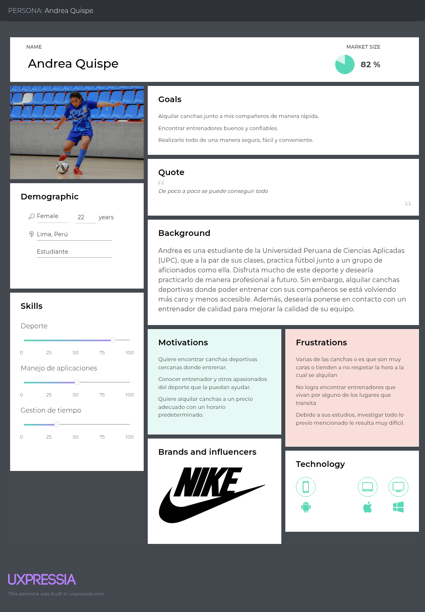

### Entrenador:
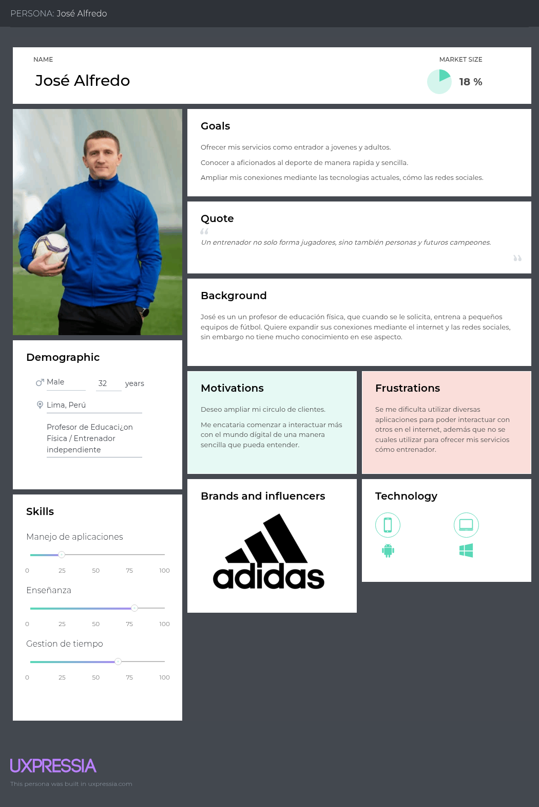

### 2.3.2. User Task Matrix

| Actividades | Frecuencia (Aficionados) | Importancia (Aficionados) | Frecuencia (Entrenadores) | Importancia (Entrenadores) |
|-------------|--------------------------|---------------------------|---------------------------|----------------------------|
| Alquilar canchas de manera sencilla y rápida | Media | Alta | Baja | Baja |
| Encontrar la cancha más apta y cercana de su ubicación | Alta | Media | Baja | Media |
| Solicitar los servicios de un entrenador | Media | Alta | Media | Alta |
| Comunicarse con el entrenador | Media | Alta | Alta | Alta |
| Poseer una opinión previa a conocer al entrenador | Baja | Alta | Media | Alta |

### 2.3.3. User Journey Mapping

**Aficionado**
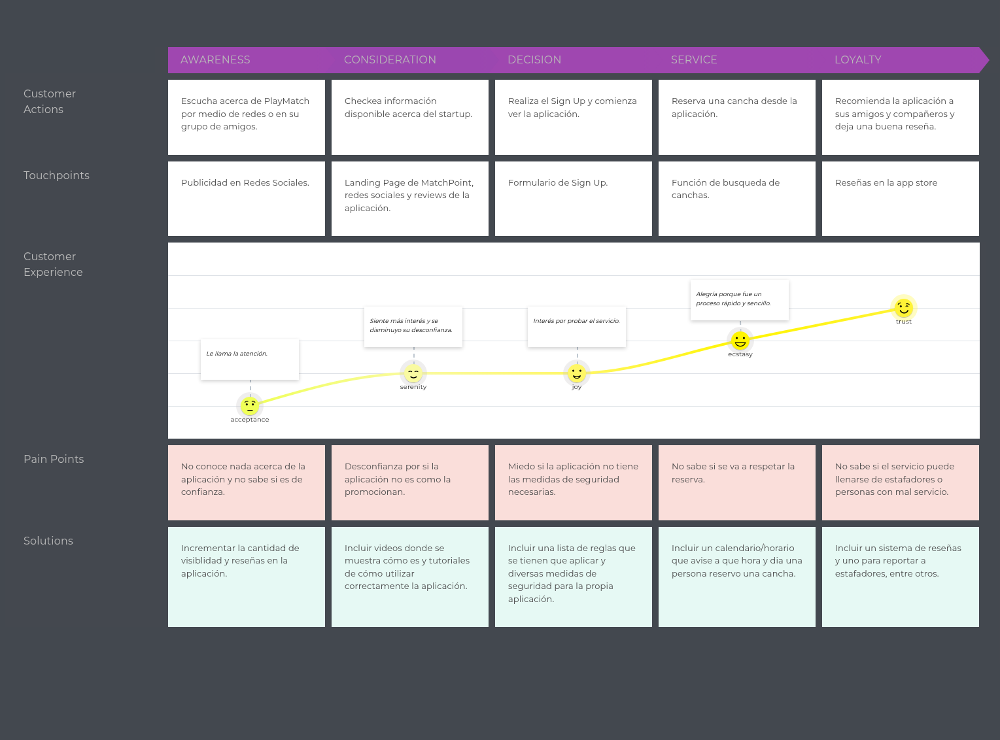

**Entrenador**
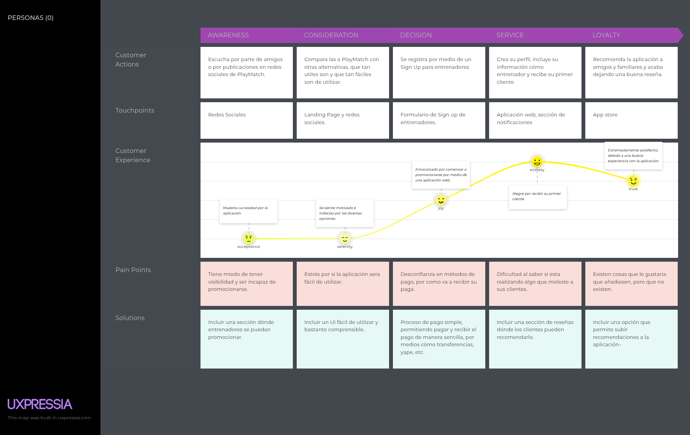

### 2.3.4. Empathy Mapping

**Aficionado**

**Entrenador**

## 2.3.5. As-is Scenario Mapping

**Aficionado**

**Entrenador**

# Capítulo III: Requirements Specification

## 3.1. To-Be Scenario Mapping

**Aficcionado**

**Entrenador**
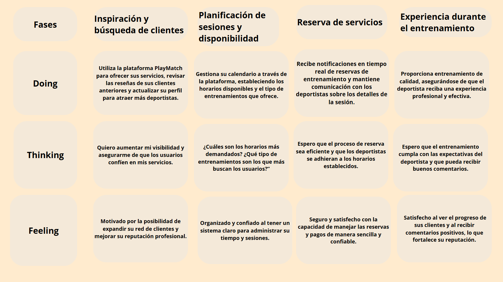

## 3.2 User Stories.

This section provides a collection of user stories that describe the functionalities and features from the end-user perspective.

## E01 - Gestión de Cuentas y Autenticación
**Descripción:** Como usuario (jugador o entrenador), necesito un sistema completo de autenticación que me permita registrarme, iniciar sesión, mantener mi perfil actualizado y cerrar sesión de forma segura, para acceder de manera controlada a todas las funcionalidades de la plataforma.

**Objetivo:** Proporcionar un sistema seguro y confiable de gestión de cuentas de usuario para la comunidad deportiva.

**Criterios de Aceptación:**
- Registro con validación de datos únicos
- Actualización de perfil personal.
- Cierre de sesión seguro con invalidación de tokens

---
## E02 - Búsqueda y Reserva de Canchas
**Descripción:** Como jugador aficionado, necesito un sistema que me permita buscar canchas deportivas disponibles según ubicación, horario, precio y deporte, para reservar en tiempo real de manera fácil y rápida.

**Objetivo:** Garantizar que los usuarios encuentren y reserven canchas deportivas de forma eficiente y confiable.

**Criterios de Aceptación:**
- Filtros de búsqueda por ubicación, deporte, precio y disponibilidad.
- Reserva confirmada en tiempo real.
- Notificación de confirmación o rechazo de reserva.

---

## E03 - Gestión de Entrenadores y Servicios
**Descripción:** Como entrenador independiente, necesito un sistema que me permita publicar mis servicios, gestionar mi agenda, definir tarifas y horarios disponibles, para ampliar mi alcance y captar más clientes.

**Objetivo:** Brindar herramientas digitales que fortalezcan la visibilidad y productividad de los entrenadores.

**Criterios de Aceptación:**
- Creación y edición de perfil profesional.
- Configuración de agenda con disponibilidad de horarios.
- Gestión de tarifas y servicios ofrecidos.

---

## E04 - Gestión de Vehículos
**Descripción:** Como usuario (jugador o entrenador), necesito un sistema de pagos en línea confiable y transparente, que me permita pagar o recibir dinero de manera rápida y segura dentro de la plataforma.

**Objetivo:** Implementar una pasarela de pago segura que garantice confianza y trazabilidad en todas las transacciones.

**Criterios de Aceptación:**
- integración con pasarelas de pago seguras.
- Generación de comprobantes digitales.
- Validación de transacciones exitosas o fallidas.

---

## E05 - Valoraciones y Reseñas
**Descripción:** Como usuario, necesito un sistema que me permita dejar reseñas y calificaciones sobre entrenadores y canchas, para ayudar a otros a elegir servicios confiables y mejorar la calidad de la comunidad.
**Objetivo:** Fomentar la confianza y transparencia en la plataforma mediante retroalimentación de los usuarios.

**Criterios de Aceptación:**
- Calificación con sistema de estrellas o puntos.
- Comentarios públicos en perfiles de entrenadores y canchas.
- Reporte de reseñas inadecuadas o fraudulentas.

---

## E06 - Organización de Partidos y Torneos
**Descripción:** Como jugador aficionado, necesito un sistema que me permita organizar partidos con amigos o unirme a torneos disponibles, para vivir experiencias deportivas más completas y dinámicas.

**Objetivo:** Facilitar la organización comunitaria de partidos y torneos para fortalecer la interacción entre usuarios.

**Criterios de Aceptación:**
- Creación de partidos privados o públicos.
- Inscripción de jugadores en torneos.
- Generación de calendario y estadísticas básicas de participación.

## User Stories

| Epic/User Story ID | Título                          | Descripción                                                                                               | Criterios de Aceptación                                                                                                                                                                                                                           | Relacionado con (Epic ID) |
|--------------------|---------------------------------|-----------------------------------------------------------------------------------------------------------|---------------------------------------------------------------------------------------------------------------------------------------------------------------------------------------------------------------------------------------------------|----------------------------|
| US01               | Registrar cuenta de jugador     | Como jugador, quiero registrarme en la plataforma, para poder acceder a las funcionalidades de búsqueda y reserva de canchas. | **Scenario: Registro exitoso de jugador** Given el jugador está en el formulario “Registro” When completa nombre, email, contraseña (≥6 caracteres) y acepta términos Then el sistema guarda los datos y envía confirmación por correo electrónico | E01 |
| US02               | Iniciar sesión como jugador     | Como jugador, quiero iniciar sesión en la plataforma, para acceder rápidamente a mi perfil y reservas.    | **Scenario: Inicio de sesión válido** Given el jugador ingresa email y contraseña correctos When pulsa “Iniciar Sesión” Then el sistema muestra la pantalla principal con su perfil cargado                                                 | E01 |
| US03               | Buscar canchas por ubicación    | Como jugador, quiero buscar canchas deportivas por ubicación, para encontrar la más cercana a mí.         | **Scenario: Búsqueda por ubicación** Given el jugador selecciona su ciudad en el filtro When el sistema consulta la base de datos Then se muestran cards con nombre, dirección, disponibilidad y botón “Reservar”                          | E02 |
| US04               | Filtrar canchas por deporte     | Como jugador, quiero filtrar las canchas por tipo de deporte, para reservar la adecuada a mi necesidad.   | **Scenario: Mostrar canchas filtradas por deporte** Given el jugador selecciona “fútbol” en el filtro When el sistema consulta la base de datos Then se muestran solo las canchas de fútbol disponibles                                      | E02 |
| US05               | Reservar cancha en línea        | Como jugador, quiero reservar una cancha en línea, para asegurar mi espacio de juego en el horario deseado. | **Scenario: Reserva exitosa** Given el jugador elige una cancha y horario disponibles When confirma la reserva y realiza el pago Then el sistema envía confirmación con código de reserva                                                   | E02 |
| US06               | Pagar reserva con tarjeta       | Como jugador, quiero pagar mi reserva en línea con tarjeta, para completar la transacción de manera rápida y segura. | **Scenario: Pago exitoso con tarjeta** Given el jugador selecciona “Pagar con tarjeta” When ingresa datos válidos de tarjeta Then el sistema procesa el pago y confirma la reserva                                                         | E04 |
| US07               | Valorar cancha reservada        | Como jugador, quiero dejar una valoración de la cancha después de usarla, para ayudar a otros usuarios a elegir mejor. | **Scenario: Publicar reseña** Given el jugador ya completó una reserva When accede a la sección de valoraciones Then puede dar calificación con estrellas y comentario                                                                    | E05 |
| US08               | Crear partido con amigos        | Como jugador, quiero crear un partido en la plataforma, para invitar a mis amigos a unirse y jugar juntos. | **Scenario: Partido creado exitosamente** Given el jugador selecciona “Crear Partido” When define fecha, hora, cancha y participantes Then el sistema genera un evento compartible e invita a los seleccionados                             | E06 |
| US09               | Registrar cuenta de entrenador  | Como entrenador, quiero registrarme en la plataforma, para ofrecer mis servicios a los jugadores.        | **Scenario: Registro exitoso de entrenador** Given el entrenador completa el formulario de registro When ingresa sus datos profesionales (nombre, especialidad, tarifa) Then el sistema crea un perfil profesional visible para los jugadores | E01 |
| US10               | Actualizar perfil profesional   | Como entrenador, quiero actualizar mi perfil con fotos, descripción y tarifas, para atraer más clientes. | **Scenario: Perfil actualizado** Given el entrenador accede a su perfil When edita información y guarda cambios Then el sistema actualiza los datos visibles a los jugadores                                                               | E03 |
| US11               | Publicar disponibilidad de horarios | Como entrenador, quiero publicar mi disponibilidad de horarios, para que los jugadores puedan reservar sesiones conmigo. | **Scenario: Disponibilidad publicada** Given el entrenador selecciona “Editar agenda” When marca horarios disponibles Then los jugadores pueden ver y reservar en esos espacios                                                            | E03 |
| US12               | Aceptar o rechazar reservas     | Como entrenador, quiero aceptar o rechazar solicitudes de reserva, para gestionar mejor mi tiempo y agenda. | **Scenario: Aceptación de reserva** Given el entrenador recibe una solicitud When pulsa “Aceptar” Then el sistema confirma la reserva y actualiza su agenda                                                                                | E03 |
| US13               | Gestionar pagos recibidos       | Como entrenador, quiero visualizar y gestionar mis pagos recibidos, para tener control sobre mis ingresos. | **Scenario: Pago confirmado** Given un jugador paga por la reserva When la transacción es exitosa Then el sistema refleja el ingreso en la cuenta del entrenador                                                                          | E04 |
| US14               | Ver estadísticas de rendimiento | Como entrenador, quiero ver estadísticas de mis entrenamientos, para mejorar mis servicios y demostrar resultados a los jugadores. | **Scenario: Estadísticas visibles** Given el entrenador accede a su panel de control When selecciona “Estadísticas” Then el sistema muestra número de sesiones realizadas, jugadores atendidos y valoraciones                              | E03 |
| US15               | Recibir reseñas de jugadores    | Como entrenador, quiero recibir reseñas de mis alumnos, para aumentar mi reputación en la plataforma.   | **Scenario: Reseña publicada** Given un jugador completó una sesión When publica una reseña Then la reseña aparece en el perfil del entrenador con calificación y comentario                                                               | E05 |
| US16               | Organizar torneos comunitarios  | Como entrenador, quiero crear y organizar torneos desde la plataforma, para atraer más jugadores y ampliar mi red de clientes. | **Scenario: Torneo creado exitosamente** Given el entrenador selecciona “Crear Torneo” When define reglas, fechas, equipos y premios Then el sistema publica el torneo y habilita inscripciones en línea                                   | E06 |

## Technical Stories

| Epic/User Story ID | Título                          | Descripción                                                                                               | Criterios de Aceptación                                                                                                                                                                                                                           | Relacionado con (Epic ID) |
|--------------------|---------------------------------|-----------------------------------------------------------------------------------------------------------|---------------------------------------------------------------------------------------------------------------------------------------------------------------------------------------------------------------------------------------------------|----------------------------|
| TS01  | Implementar autenticación basada en JWT      | Como desarrollador, implementar autenticación con JWT para proteger sesiones y accesos.        | **Scenario: Generación de JWT al inicio de sesión** Given credenciales válidas When el usuario inicia sesión Then el sistema genera un JWT válido And lo devuelve al cliente | — |
| TS02  | Validación de JWT en endpoints protegidos    | Como desarrollador, validar JWT en cada request a endpoints privados para asegurar acceso autorizado.          | **Scenario: Validación de JWT** Given un usuario con JWT válido When realiza una petición Then el sistema valida el token And concede acceso al recurso | — |
| TS03  | Manejo de expiración de tokens JWT           | Como desarrollador, manejar expiración del JWT obligando renovación o uso de refresh tokens.                | **Scenario: JWT expirado** Given un usuario con JWT caducado When intenta acceder a un recurso Then el sistema devuelve 401 Unauthorized And solicita nueva autenticación | — |
| TS04  | Almacenamiento seguro de tokens              | Como desarrollador, almacenar JWT con buenas prácticas (HttpOnly / sessionStorage).       | **Scenario: Almacenamiento seguro** Given el servidor genera un JWT válido When lo envía al cliente Then debe almacenarse con configuraciones seguras | — |
| TS05  | Implementar API de búsqueda de canchas       | Como desarrollador, implementar endpoint para filtrar canchas por ubicación, deporte y precio.     | **Scenario: Filtro de canchas** Given un usuario selecciona filtros When consulta la API Then se devuelven solo las canchas que cumplen los criterios |
| TS06  | Sistema de reservas en tiempo real           | Como desarrollador, implementar lógica para evitar reservas simultáneas de la misma cancha. | **Scenario: Reserva en conflicto** Given dos usuarios seleccionan la misma cancha When ambos intentan reservar Then el sistema permite solo la primera confirmación |
| TS07  | Integración con pasarela de pagos            | Como desarrollador, integrar Stripe u otra pasarela para pagos en línea.       | **Scenario: Pago exitoso** Given un usuario realiza un pago When el pago es aprobado Then el sistema confirma la reserva y genera comprobante |
| TS08  | Generación de comprobantes digitales         | Como desarrollador, generar PDFs tras pagos exitosos.     | **Scenario: Comprobante generado** Given un pago exitoso When se completa la transacción Then el sistema genera un comprobante en PDF |
| TS09  | API de gestión de entrenadores               | Implementar endpoints CRUD de perfiles, horarios y tarifas.                | **Scenario: Actualización de perfil** Given un entrenador edita su perfil When envía cambios a la API Then el sistema guarda y actualiza la información |
| TS10  | Panel de administración de agenda            | Construir módulo backend para disponibilidad de entrenadores.              | **Scenario: Agenda publicada** Given un entrenador selecciona horarios When guarda la agenda Then el sistema actualiza disponibilidad visible a los jugadores |
| TS11  | Notificaciones de reserva a entrenadores     | Implementar push/email para notificaciones de reserva.  | **Scenario: Reserva recibida** Given un jugador reserva When el sistema confirma Then envía notificación al entrenador asociado |
| TS12  | Gestión de pagos para entrenadores           | Módulo backend para visualizar ingresos y retiros.                           | **Scenario: Visualizar ingresos** Given un entrenador con reservas pagadas When accede a “Mis ingresos” Then el sistema muestra pagos confirmados y pendientes |
| TS13  | Sistema de valoraciones y reseñas            | Implementar sistema de reviews con calificación.      | **Scenario: Reseña publicada** Given un jugador completó una reserva When envía una reseña Then el sistema la guarda y la asocia al perfil correspondiente |
| TS14  | Moderación de comentarios                    | Implementar moderación de reseñas inadecuadas.              | **Scenario: Reseña reportada** Given un usuario reporta una reseña When se recibe el reporte Then el sistema marca la reseña como pendiente de revisión |
| TS15  | Organización de torneos                      | Endpoints para crear torneos, inscripciones y fixtures. | **Scenario: Torneo creado** Given un entrenador crea un torneo When completa reglas, fechas y equipos Then el sistema publica el torneo disponible para inscripciones |
| TS16  | Estadísticas de participación y rendimiento  | Implementar módulo de estadísticas.              | **Scenario: Estadísticas visibles** Given un usuario accede al panel de estadísticas When consulta sus datos Then el sistema muestra gráficos y métricas |

## 3.3 Impact Mapping.

## 3.4 Product Backlog.

This section lists the prioritized product backlog items, including features, enhancements, and technical tasks.

| #Orden | User Story ID | Título                          | Descripción (resumen)                                                                                   | Story Points |
|--------|---------------|---------------------------------|---------------------------------------------------------------------------------------------------------|--------------|
| 1      | US01          | Registrar cuenta de jugador     | Alta de usuario jugador (nombre, email único, contraseña ≥ 6, validación)                               | 5            |
| 2      | US02          | Iniciar sesión como jugador     | Autenticación (JWT) y acceso al dashboard con perfil personal                                           | 3            |
| 3      | US03          | Buscar canchas por ubicación    | Filtro de canchas por ciudad/distrito con cards de resultado                                            | 5            |
| 4      | US04          | Filtrar canchas por deporte     | Selección de tipo de deporte (fútbol, tenis, vóley, etc.) en filtros de búsqueda                        | 3            |
| 5      | US05          | Reservar cancha en línea        | Selección de cancha y horario → Confirmación de reserva                                                 | 8            |
| 6      | US06          | Pagar reserva con tarjeta       | Integración con pasarela de pago segura (Stripe u otra)                                                 | 5            |
| 7      | US07          | Valorar cancha reservada        | Publicación de reseñas y calificación con estrellas                                                     | 3            |
| 8      | US08          | Crear partido con amigos        | Formulario de creación de partido con fecha, hora, cancha e invitaciones                                | 5            |
| 9      | US09          | Registrar cuenta de entrenador  | Alta de usuario entrenador (datos personales, especialidad, tarifas)                                    | 5            |
| 10     | US10          | Actualizar perfil profesional   | CRUD de perfil de entrenador (fotos, descripción, tarifas)                                              | 3            |
| 11     | US11          | Publicar disponibilidad de horarios | Panel de agenda para definir horarios disponibles                                                      | 5            |
| 12     | US12          | Aceptar o rechazar reservas     | Gestión de solicitudes de reserva con botones Aceptar/Rechazar                                          | 5            |
| 13     | US13          | Gestionar pagos recibidos       | Panel de control con listado de ingresos confirmados y pendientes                                       | 5            |
| 14     | US14          | Ver estadísticas de rendimiento | Módulo de estadísticas (sesiones dictadas, valoraciones, jugadores atendidos)                           | 3            |
| 15     | US15          | Recibir reseñas de jugadores    | Listado de reseñas con calificación y comentarios visibles en el perfil del entrenador                   | 3            |
| 16     | US16          | Organizar torneos comunitarios  | Creación de torneos: reglas, equipos, fechas, inscripciones y fixtures                                  | 8            |

# Capítulo IV: Product Design

## 4.1. Style Guidelines

Con el objetivo de asegurar coherencia visual y comunicacional a lo largo de todos los puntos de contacto con los usuarios, se define una guía de estilo centralizada para el equipo de diseño y desarrollo. Esta guía permitirá mantener una presentación consistente tanto en plataformas web como móviles, alineada con los valores de sostenibilidad, inclusión y responsabilidad promovidos por **PlayMatch**.

### 4.1.1. General Style Guidelines
PlayMatch emplea un diseño moderno orientado a la funcionalidad, accesibilidad, minimalismo y estética limpia. 

**Paleta de colores: **Teniendo en cuenta nuesto publico objetivo y el nicho a apuntar, nos decidimos por la siguiente paleta de colores:

- Gris oscuro - #22333B. Será utilizado cómo color de fondo general o color de subfondo para secciones secundarias o bloques de contenido. Es una alternativa más sofisticada al negro puro, ya que ofrece una sensasión de sofisticación y estabilidad, además de permitirnos emplear colores más vibrantes para los botones o elementos más importantes.
- Rojo oscuro: #621708. El rojo está asociado con la energía, pasión y determinación. Este tono oscuro es perfecto para elementos de marca que buscamos que se sientan poderosos o serios. Se usará en nuestro logo, iconos, o para resaltar titulares, incluso como subfondo en algunos casos.
- Rojo base - #941B0C. Este tono de rojo, más vivo que el anterior, será usado para resaltar información importante o para diferenciar secciones, además de CTA secundario. Será usado en cajas de información, tarjetas de perfil del entrenador o para subrayar títulos. Buscamos captar la atención del usuario sin la intensidad del naranja.
- Naranja - #BC3908. El color naranja evoca entusiasmo, actividad y creatividad. Es la elección para los CTAs principales cómo reservar ahora, buscar entrenador o regístrate. El contraste de este color con el fondo gris oscuro guiará al usuario a través de la interfaz.
- Amarillo - #F6AA1C. El amarillo es el color de la alegría, optimismo y visibilidad. Se usará como color de acento complementario. Usado en elementos que necesiten un toque extra de atención pero con una importancia menor que los CTA, por ejemplo en etiquetas de Nuevo o Promoción, notificaciones o para destacar valoraciones de estrellas en perfiles de entrenadores o canchas.
- Blanco - #EBF5DF. Sobre nuestro fondo gris oscuro, este tono de blanco es la opción más legible y profesional para el texto. Un texto claro sobre un fondo oscuro es una tendencia de diseño moderna y elegante que además reduce la fatiga visual.
- Gris claro - #D9D9D9. Este tono de gris se usará como color secundario de textos, como descripciones o subtitulos. Esta practica nos ayuda a crear una jerarquía visual clara y ayuda a que el contenido principal destaque. Por último, este color también lo usamos como subfondo en áreas específicas para crear dinamismo.

**Tipografía** La tipografía principal para PlayMatch es Fira Sans, seleccionada por su legibilidad en pantalla y su estilo moderlo y profesional. Es una fuente ideal para encabezados y elementos de interfaz importantes. Para el cuerpo del texto y elementos secundarios se emplea Open Sans, ya que de igual forma es una fuente legible y versátil, además que se complementa a la perfección con Fira Sans, esto garantiza una lectura cómoda y una jerarquía visual clara en toda la plataforma.

**Escala**
- Base: 16px
- Ratio: 1.25 (Tercio mayor)
- Tipografía: Fira Sans (encabezados) y Open Sans (cuerpo de texto)
- Interlineado: 1.5
- Pesos
- - Thin (100)
  - ExtraLight (200)
  - Light (300)
  - Regular(400)
  - Medium (500)
  - SemiBold (600)
  - Bold (700)
  - ExtraBold (800)
  - Black (900)

**Nomenclatura**
Nombre / Tamaño / Peso
- H1 / 40px / Fira Sans SemiBold
- H2 / 32px / Fira Sans Medium
- H3 / 25.6px / Fira Sans Regular
- Subtitle / 20.48px / Open Sans Light
- Body / 16px / Open Sans Regular
- Caption / 12.8px / Open Sans Light

**Branding e ícono** El ícono de playmatch representa la conexión, la energía y la organización del deporte. El ícono central es la combinación de un balón con dos flechas que se cruzan. El balón simboliza el deporte y el juego, mientras que las flechas representan la conexión entre los jugadores y entrenadores. Una fe las flechas apunta hacia arriba, simbolizando el crecimiento y la auto mejora. 

### 4.1.2. Web Style Guidelines
La versión web de PlayMatch está diseñada para ofrecer una experiencia fluida e intuituva, tanto para deportistas aficionados como para entrenadores. Su diseño es responsivo y dinámico, para adaptarse a las necesidades de un usuario activo.

- Diseño responsivo: La plataforma se adapta perfectamente a dispositivos de escritorio, tabletas y móviles, lo que garantiza una experiencia de usuario consistente, ya sea que se encuentre en casa, en la cancha o en movimiento.
- Hover effects: Los elementos interactivos como botones y tarjetas, cambian sutilmente de colo al pasar el cursor sobre ellos. Por ejemplo, los botones de llamado a la acción naranja, pueden oscurecerse ligeramente para indicar que son seleccionables.
- Barra de navegación superior: La barra de navegación principal está ubicada en la parte superior e incluye accesos clave cómo inicio, buscar canchas, buscar entrenadores, mis reservas y perfil. Esto asegura que los usuarios puedan navegar a las secciones más importantes de manera rápida y eficiente
- Animaciones sutiles: Se emplean transiciones suaves para mejorar la experiencia de usuario. Las animaciones sutiles como el deslizamiento de los paneles al abrir un menú o el cambio de estado de un botón al ser presionado, hacen que la interacción se sienta más fluida, moderna y profesional.
- Paneles modulares: El contenido cómo los perfiles de entrenadores, los resultados de búsqueda o las estadísticas de partidos, se organizará en paneles modulares y tarjetas. Esto para facilitar tanto la lectura y escaneo de información, como para adaptarse mejor a los diferentes tamaños de pantalla.

## 4.2. Information Architecture

En esta sección se definen las decisiones de arquitectura de información que dirigen cómo se organizará el contenido en las experiencias web de **PlayMatch**, incluyendo el Landing Page y futuras aplicaciones. El objetivo principal es garantizar que los visitantes y usuarios se adapten de manera intuitiva a la funcionalidad de cada producto, puedan encontrar fácilmente lo que necesitan y logren una navegación fluida y satisfactoria.

Las propuestas de arquitectura están diseñadas siguiendo principios de usabilidad, claridad y accesibilidad, abordando los siguientes componentes:

- **Organization Systems**
- **Labeling Systems**
- **SEO Tags and Meta Tags**
- **Searching Systems**
- **Navigation Systems**

### 4.2.1. Organization Systems

Se establecen las siguientes decisiones sobre la organización del contenido:

#### Visual Hierarchy

Se aplicará una **jerarquía visual clara** en todas las páginas, priorizando:

- "Explorar Canchas"
- "Entrenadores"
- "Mis Reservas"
- "Mi Suscripción"

El tamaño, color y peso de los elementos gráficos ayudarán a guiar la atención del usuario hacia lo más relevante.

#### Secuencial Organization

En procesos clave como:

- "Registro de Entrenadores"
- "Creación de Torneos"
- "Proceso de Reserva de Cancha o Entrenador"

Se usará una **organización paso a paso**, facilitando al usuario completar acciones en orden lógico:

Ejemplo del proceso de reserva de cancha:

1. Seleccionar deporte.
2. Escoger cancha disponible (según horario).
3. Confirmar detalles (número de jugadores, duración).
4. Realizar pago y recibir confirmación.

#### Matricial Organization

Para listas de canchas o entrenadores disponibles, se aplicará un modelo **matricial**:

- Comparar opciones al mismo nivel.
- Uso de filtros por: precio, cercanía, disponibilidad, nivel del entrenador, calificaciones.

Esto permite que un deportista compare rápidamente entre diferentes canchas y entrenadores.

#### Esquemas de Categorización

Según el tipo de contenido, se aplicarán distintos esquemas:

- **Por tópicos**: deportes (fútbol, vóley, tenis, básquet).
- **Por audiencia**: canchas o entrenadores recomendados para “Jugadores ocasionales” vs. “Deportistas frecuentes”.
- **Cronológico**: reservas próximas y partidos programados.
- **Alfabético**: listado de entrenadores por nombre en catálogos extensos.

Esto permite un acceso eficiente, adaptado a las distintas formas en que los usuarios buscan canchas o entrenadores.

### 4.2.2. Labeling Systems

La representación de los datos en la plataforma busca ser clara, intuitiva y evitar confusión. Para ello se establecen las siguientes directrices de etiquetado:

#### Principios de Etiquetado

- Utilizar un **mínimo número de palabras**.
- Preferir términos **comunes en el ámbito deportivo** y **fáciles de comprender**.
- Mantener **consistencia** en la terminología a lo largo de la aplicacion.

#### Etiquetas principales propuestas

| Área                    | Etiqueta asignada          | Propósito                           |
| ----------------------- | -------------------------- | ----------------------------------- |
| Exploración             | "Explorar Canchas"         | Navegar entre experiencias.         |
| Entrenadores            | "Entrenadores              | Buscar y reservar entrenadores independientes. |
| Reservas                | "Mis Reservas"             | Historial de reservas confirmadas.  |
| Suscripción             | "Mi plan"                  | Acceso al plan actual y opciones de upgrade.|
| Torneos                 | "Torneos"                  | Participar o crear torneos organizados.      |
| Búsqueda                | "Buscar"                   | Entrada de texto para buscar canchas/entrenadores.  |
| Perfil                  | "Mi Perfil"                | Datos personales del usuario.       |

Además, las etiquetas dentro de los filtros utilizarán palabras clave simples como:

- "Tipo de deporte" (fútbol, vóley, básquet, tenis).
- "Ubicación" (distrito o zona).
- "Horario disponible".
- "Precio".
- "Nivel del entrenador" (básico, intermedio, avanzado).
- "Valoración" (por estrellas o reseñas).

Esto facilita que tanto **deportistas** como **entrenadores** interpreten de inmediato las opciones disponibles sin necesidad de explicaciones adicionales..

### 4.2.3. SEO Tags and Meta Tags

Para optimizar la visibilidad y accesibilidad de PlayMatch en motores de búsqueda, se establecen los siguientes **SEO Tags** y **Meta Tags** que serán implementados tanto en el **Landing Page** como en la **Web Application**:

TODO: Agregar meta tags para páginas adicionales (no app). Blog, Noticias, Precio, Log In, Sign Up, etc.

| Página                           | Title                                            | Meta Description            | Meta Keywords            | Author         |
| -------------------------------- | ------------------------------------------------ | ----------------------------------------------------------------------------------------------- | --------------------------------------------------------------------- | -------------- |
| Landing Page                     | Reserva Canchas y Conecta con Entrenadores en Perú - PlayMatch         | PlayMatch es la plataforma líder para reservar canchas deportivas y encontrar entrenadores de baloncesto, fútbol y más. Organiza tus partidos y entrenamientos de forma fácil. | entrenadores deportivos, reservar canchas, canchas deportivas, entrenadores de baloncesto, fútbol, perú, canchas cerca de mí | Equipo PlayMatch |
| Web Application - Home           | PlayMatch App - Juega y Entrena sin Complicaciones | Organiza partidos, encuentra entrenadores y gestiona tus reservas deportivas en un solo lugar.            | reservar cancha online, entrenadores deportivos, gestión de partidos | Equipo PlayMatch |
| Web Application - Perfil Usuario | PlayMatch - Mi Perfil                              | Gestiona tus datos, reservas y suscripciones fácilmente con PlayMatch.                               | perfil usuario PlayMatch, reservas deportivas, suscripciones deportivas                    | Equipo PlayMatch |
| Página de perfil de entrenadores | Entrenador de [[Deporte]] en [[Ciudad]] - [Nombre del Entrenador] - PlayMatch | Encuentra al entregador de [[Deporte]], [[Nombre del Entrenador]] en [[Ciudad]] a través de PlayMatch. Horarios flexibles, tarifas competitivas y valoraciones recientes. | Entrenadores cerca de mi, entrenadores de [[deporte]], entrenador en [[ciudad]] | Equipo PlayMatch |

### 4.2.4. Searching Systems

Para mejorar la **capacidad de búsqueda** dentro del sitio web y la aplicación, se implementarán sistemas claros, efectivos y centrados en la experiencia deportiva.

#### Tipos de búsqueda ofrecidos

- **Búsqueda Global (Header Search Box):**

  - Visible en todas las páginas principales.
  - Permite buscar canchas, entrenadores o torneos.
  - Incluye **autocompletado** con sugerencias relevantes (ejemplo: “Fútbol en San Miguel”, “Entrenador de vóley”, “Torneo de básquet”).

- **Filtros de búsqueda en "Explorar experiencias":**

  - **Tipo de deporte** (Fútbol, Vóley, Básquet, Tenis, Otros).
  - **Ubicación** (distrito, ciudad, zona cercana mediante geolocalización).
  - **Disponibilidad horaria** (mañana, tarde, noche, fecha específica).
  - **Precio** (rango económico ajustable).
  - **Nivel de entrenador** (Básico, Intermedio, Avanzado).
  - **Valoración** (según reseñas de usuarios).

- **Búsqueda específica en el perfil de entrenadores/canchas:**
  - Por nombre del entrenador o nombre del recinto.
  - Por calificación promedio de usuarios.

#### Presentación de resultados

- **Resultados dinámicos:** el listado se actualizará en tiempo real al aplicar filtros o realizar búsquedas.
- **Organización matricial:** cada resultado se mostrará en forma de card con:

  - Imagen de la cancha o entrenador.
  - Nombre y categoría.
  - Valoración promedio.
  - Botón de acción destacado (Reservar, Ver disponibilidad).

- **Resultados ordenables:** por:
  - relevancia
  - precio
  - valoración
  - Disponibilidad más próxima.
 
Con este sistema, PlayMatch ofrece búsquedas rápidas, comparaciones claras y filtros relevantes que permiten a los usuarios encontrar lo que necesitan sin complicaciones.

### 4.2.5. Navigation Systems

Está diseñada para guiar a los usuarios (deportistas, entrenadores y administradores) de manera fluida, asegurando que encuentren lo que buscan de forma natural e intuitiva.

**Principios de navegación**
- **Navegación principal fija** : barra superior presente en todo momento, accesible desde cualquier parte de la aplicación.
- **Accesos rápidos**: a las secciones principales: Explorar Canchas, Mis Reservas, Entrenadores, Perfil.
- **Navegación progresiva**: acciones importantes (reservar cancha, agendar sesión con entrenador, unirse a un torneo) se presentan en momentos contextuales apropiados, evitando saturación.
- **Pistas visuales**: utilización de colores, íconos y estados activos en menús para indicar dónde se encuentra el usuario.
- **Breadcrumbs**: en procesos secuenciales como la reserva de canchas o la inscripción a torneos, para mostrar al usuario en qué etapa se encuentra.

**Flujo de navegación en la Landing Page**
1. El visitante accede a la Landing Page.
2. Puede navegar rápidamente a:
    - Explorar canchas disponibles
    - Conocer más sobre MatchPoint
    - Registrarse como Deportista o Entrenador

3. Se invita a la acción con CTA claros como:
    - “Reserva tu cancha ahora”
    - “Encuentra a tu entrenador ideal”

**Flujo de navegación en la Web Application**
- Menú principal con íconos + texto (Inicio, Canchas, Entrenadores, Mis Reservas, Perfil).
- En Canchas, se pueden filtrar por ubicación, precio y disponibilidad, y luego reservar.
- En Entrenadores, se exploran perfiles de coaches, se consultan reseñas y se agenda una sesión.
- Desde Mis Reservas, se visualizan próximas reservas y se gestionan cambios/cancelaciones.
- En Perfil, se gestionan datos personales, historial de reservas, medios de pago y configuraciones.

## 4.3. Landing Page UI Design
### 4.3.1. Landing Page Wireframe

#### Home
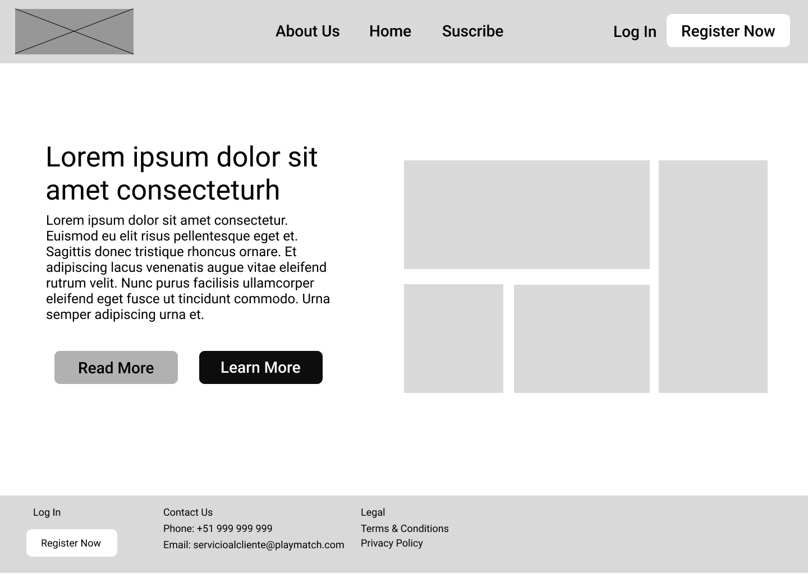

#### About Us

### Learn More

### Suscribe
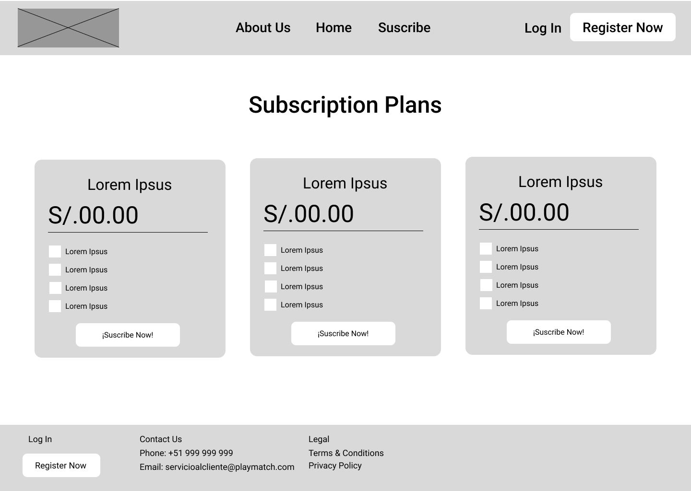

### 4.3.2. Landing Page Mock-up

#### Home

#### About Us

### Learn More

### Suscribe

## 4.4. Web Applications UX/UI Design

### 4.4.1. Web Applications Wireframes

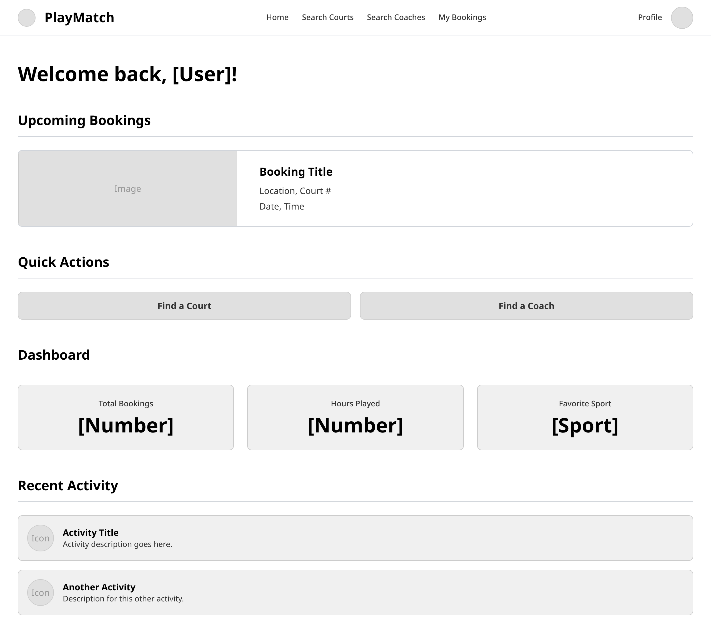
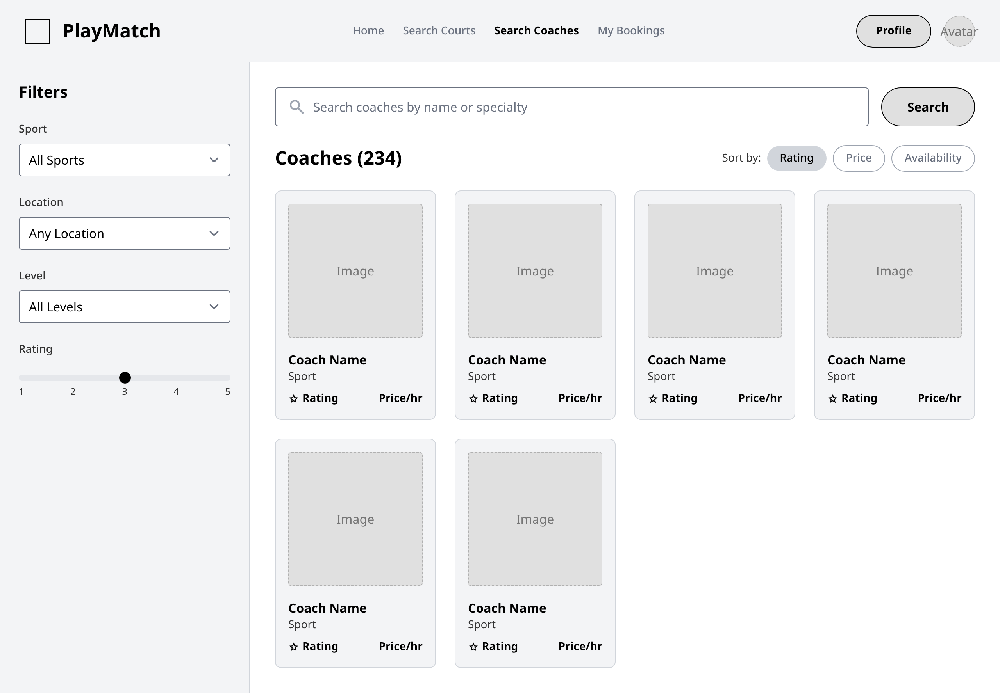
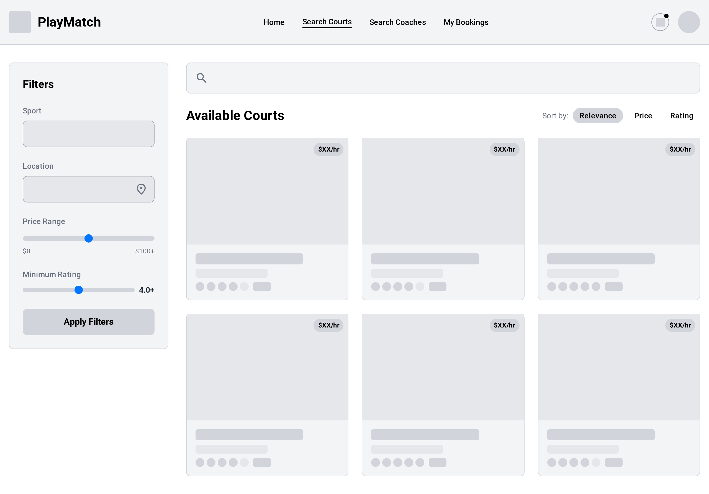
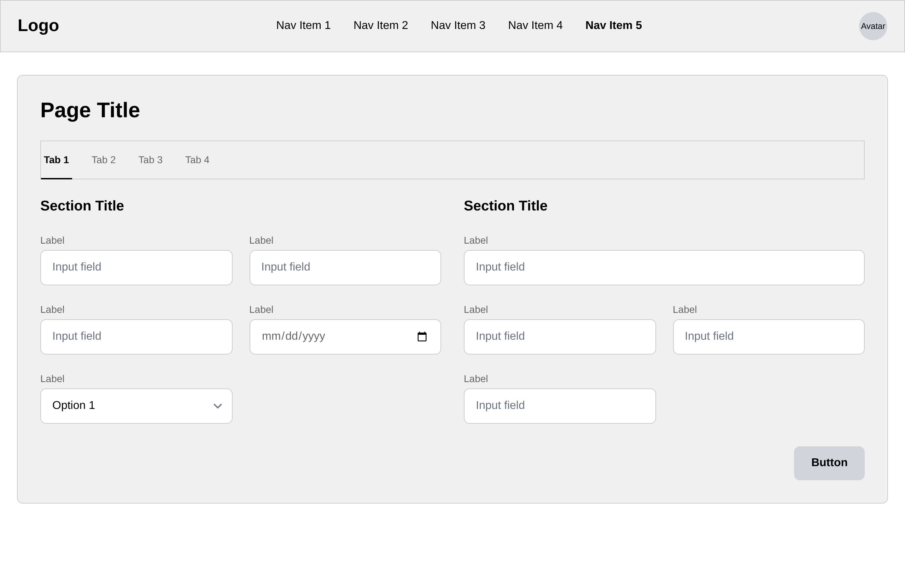

### 4.4.2. Web Applications Wireflow Diagrams

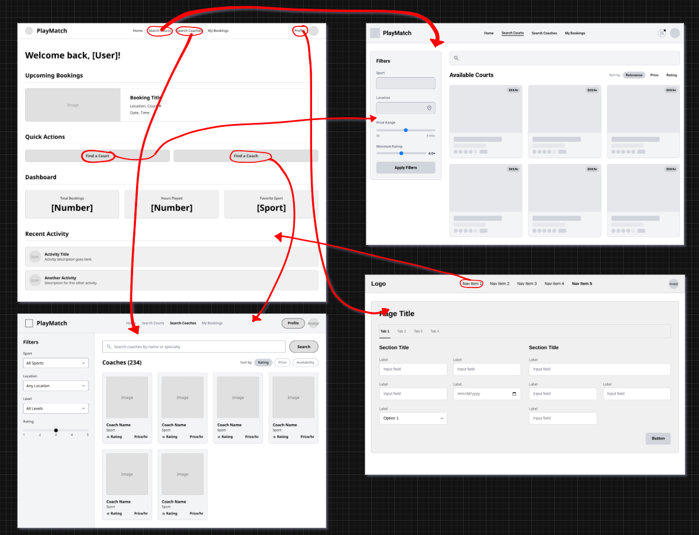

### 4.4.3. Web Applications Mock-ups

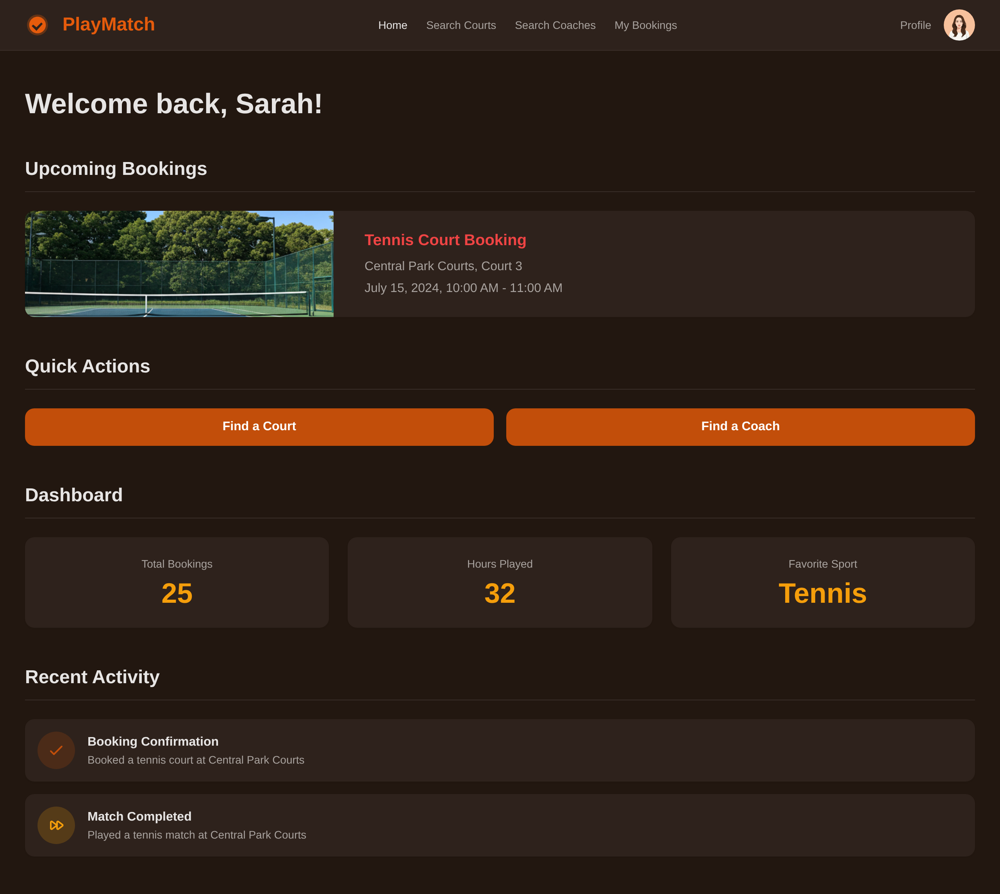
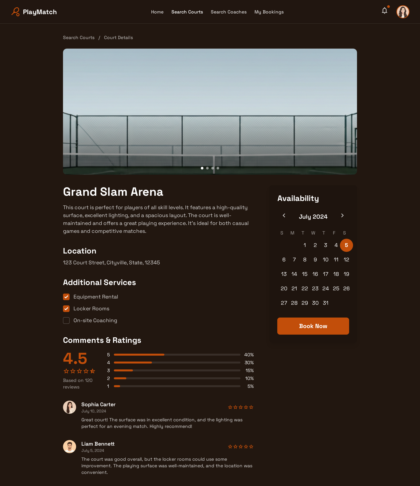
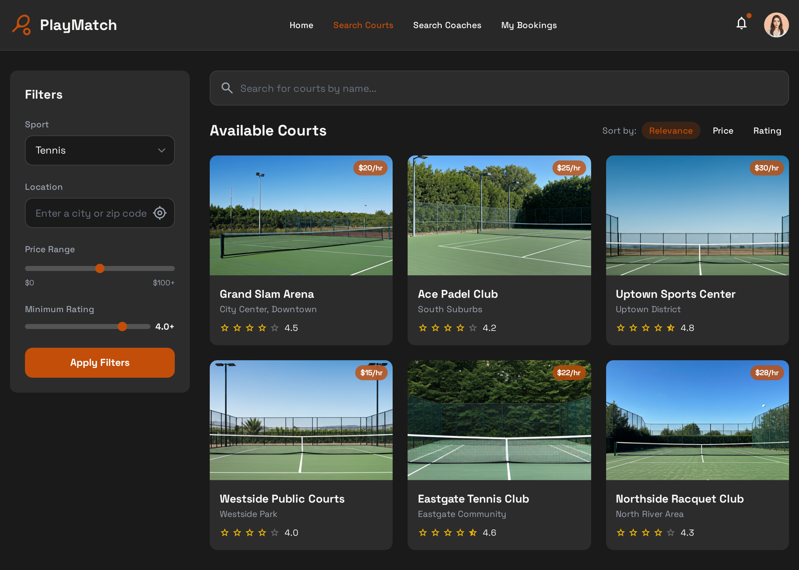
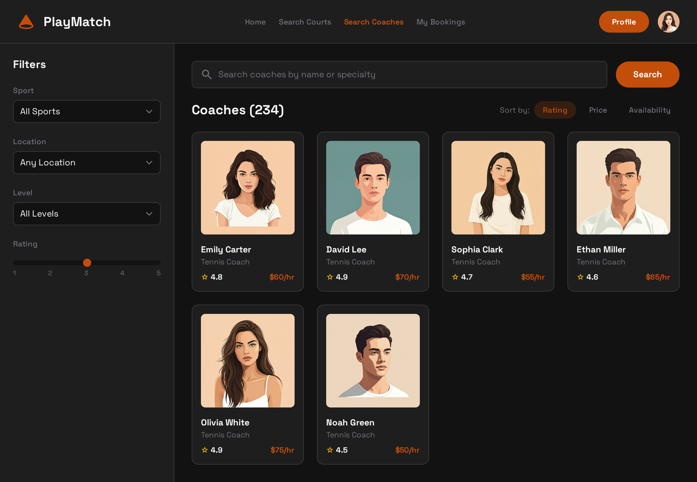

### 4.4.4. Web Applications User Flow Diagrams

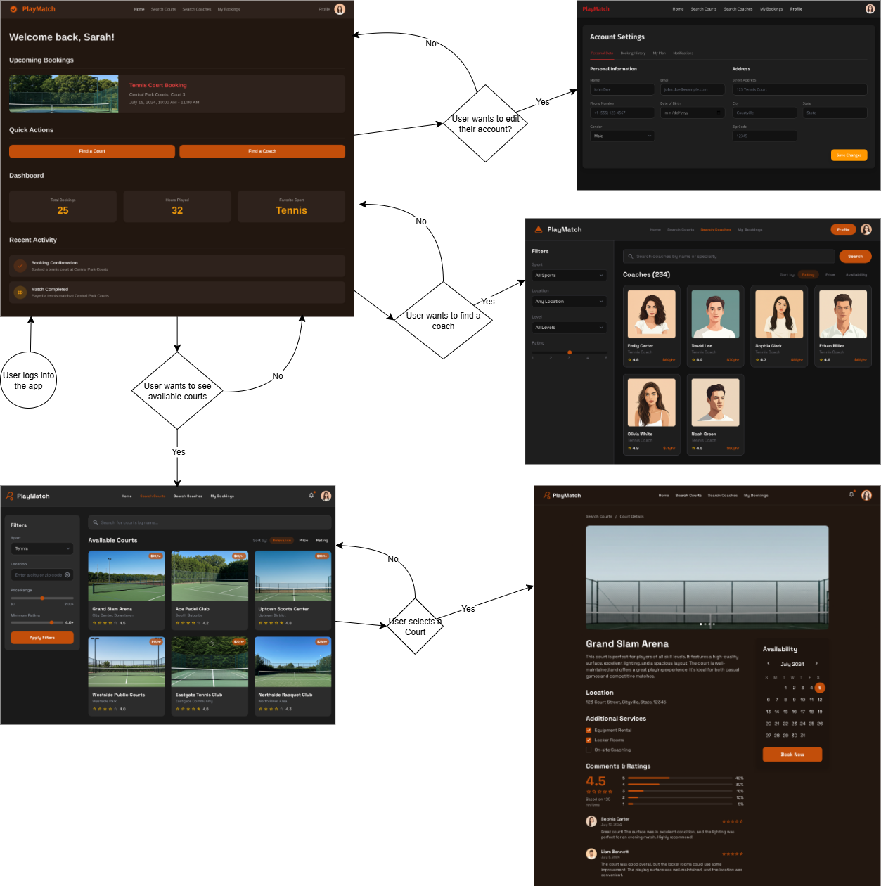

## 4.5. Web Applications Prototyping
## 4.6. Domain-Driven Software Architecture
### 4.6.1. Software Architecture Context Diagram

### 4.6.2. Software Architecture Container Diagrams

### 4.6.3. Software Architecture Components Diagrams

## 4.7. Software Object-Oriented Design
### 4.7.1. Class Diagrams

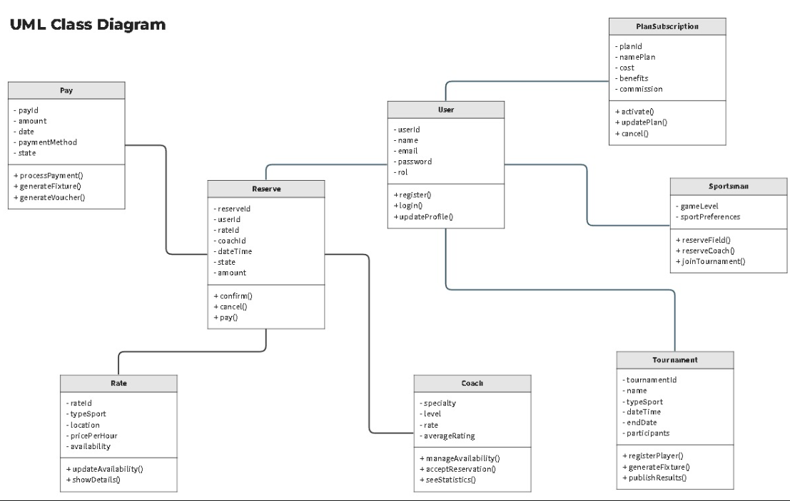

### 4.7.2. Class Dictionary

#### 1. Clase: User
- Atributos:
  - userId: int → Identificador único del usuario
  - name: String → Nombre del usuario
  - email: String → Correo electrónico
  - password: String → Contraseña
  - rol: String → Rol asignado (ej. Sportsman, Coach, Admin)

- Métodos:
  - register() → Registra un nuevo usuario
  - login() → Autentica al usuario en el sistema
  - updateProfile() → Actualiza datos personales
 
#### 2. Clase: Pay
- Atributos:
  - payId: int → Identificador único del pago
  - amount: double → Monto pagado
  - date: Date → Fecha del pago
  - paymentMethod: String → Método de pago (tarjeta, efectivo, etc.)
  - state: String → Estado del pago (pendiente, confirmado, fallido)

- Métodos:
  - processPayment() → Procesa el pago
  - generateFixture() → Genera comprobante del pago
  - generateVoucher() → Genera voucher de confirmación
 
#### 3. Clase: Reserve
- Atributos:
  - reserveId: int → Identificador único de la reserva
  - userId: int → Usuario que realiza la reserva
  - rateId: int → Cancha reservada
  - coachId: int → Entrenador asignado
  - dateTime: DateTime → Fecha y hora de la reserva
  - state: String → Estado de la reserva (pendiente, confirmada, cancelada)
  - amount: double → Monto de la reserva
 
- Métodos:
  - confirm() → Confirma la reserva
  - cancel() → Cancela la reserva
  - pay() → Asocia la reserva a un pago
 
#### 4. Clase: Rate
- Atributos:
  - rateId: int → Identificador único de la cancha
  - typeSport: String → Tipo de deporte
  - location: String → Ubicación de la cancha
  - pricePerHour: double → Precio por hora
  - availability: boolean → Disponibilidad

- Métodos:
  - updateAvailability() → Actualiza disponibilidad de la cancha
  - showDetails() → Muestra información de la cancha
 
#### 5. Clase: Coach
- Atributos:
  - specialty: String → Especialidad deportiva
  - level: String → Nivel de experiencia
  - rate: double → Tarifa por hora
  - averageRating: double → Calificación promedio
 
- Métodos:
  - manageAvailability() → Gestiona disponibilidad del coach
  - acceptReservation() → Acepta una reserva de entrenamiento
  - seeStatistics() → Muestra estadísticas de desempeño
 
#### 6. Clase: PlanSubscription
- Atributos:
  - planId: int → Identificador del plan
  - namePlan: String → Nombre del plan
  - cost: double → Costo del plan
  - benefits: String → Beneficios incluidos
  - commission: double → Comisión asociada

- Métodos:
  - activate() → Activa el plan
  - updatePlan() → Actualiza beneficios o costo
  - cancel() → Cancela el plan
 
#### 7. Clase: Sportsman
- Atributos:
  - gameLevel: String → Nivel de juego del deportista
  - sportPreferences: String → Preferencias deportivas

- Métodos:
  - reserveField() → Reserva una cancha
  - reserveCoach() → Reserva un entrenador
  - joinTournament() → Inscripción en torneos

#### 8. Clase: Tournament
- Atributos:
  - tournamentId: int → Identificador del torneo
  - name: String → Nombre del torneo
  - typeSport: String → Tipo de deporte
  - dateTime: DateTime → Fecha de inicio
  - endDate: DateTime → Fecha de finalización
  - participants: List<User> → Participantes inscritos

- Métodos:
  - registerPlayer() → Inscribe a un jugador
  - generateFixture() → Genera el cronograma del torneo
  - publishResults() → Publica resultados finales
  
## 4.8. Database Design
### 4.8.1. Database Diagram

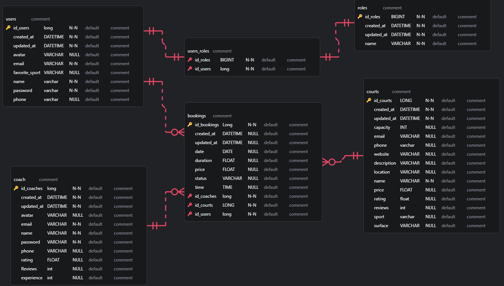

## 5.1. Software Configuration Management.

### 5.1.1. Software Development Enviroment Configuration

#### Requirements Management

1. Canva: Es una herramienta de diseño utilizada para realizar los user persona, empathy mapping, Lean UX Canvas, As-is Scenario Mapping y otros elementos importantes más. Esta aplicación está basada en un sistema de diseño simple en el cual puedes mover y editar objetos para lograr el objetivo de diseñar nuestras piezas escenciales de análisis de mercado para nuestra aplicación. Ruta de referencia: https://www.canva.com/es_es/.

2. Figma: Plataforma de elaboración de prototipos y edición gráfica, que usamos principalmente para nuestra Landing Page y Web Application, tanto para los Wireframes y los MockUps, al igual que para nuestros Wireflows Diagrams. Ruta de referencia: https://www.figma.com/.

3. Vertabelo: Plataforma basada en creación, gestión y realización de gráficos para organizar las herencias y dependencias de nuestros programas y/o bases de datos. Como en nuestro caso fue implementada para realizar nuestros Class Diagrams y nuestra Database Diagrams. Ruta de referencia https://vertabelo.com/.

#### Software Devlopment

1. JetBrains WebStorm: Es un entorno de desarrollo integrado (IDE) enfocado en el desarrollo web. Ofrece herramientas que facilitan la prueba del proyecto en diversos navegadores como Chrome, Microsoft Edge, Safari y Mozilla Firefox. El uso de WebStorm aporta un valor agregado al desarrollo, ya que permite visualizar cómo funciona la aplicación en múltiples plataformas y proporciona soporte avanzado para la edición de código en varios lenguajes compatibles. Ruta de Referencia: https://www.jetbrains.com/es-es/webstorm/.

2. HTML5: Lenguaje de marcado utilizado para estructurar y presentar contenido en la web. Es una herramienta fundamental en nuestro proyecto, ya que se emplea para construir la base del contenido de la aplicación. Ruta de Referencia: https://www.w3schools.com/html/.

3. CSS: Conocido como Hojas de Estilo en Cascada (Cascading Style Sheets), este lenguaje trabaja en conjunto con HTML5 para definir el diseño y la presentación visual de la aplicación. Permite personalizar estilos como colores, tipografías y distribución de los elementos. Ruta de Referencia: https://developer.mozilla.org/es/docs/Web/CSS.

4. JavaScript: Lenguaje de programación orientado a objetos e interpretado en el navegador. Se utilizará principalmente para desarrollar la interfaz dinámica de usuario en nuestro proyecto, facilitando la interactividad dentro de la aplicación. Ruta de Referencia: https://developer.mozilla.org/es/docs/Web/JavaScript.

#### Software Deployment

1. Git: Es una herramienta de control de versiones diseñada para mejorar la eficiencia, confiabilidad y compatibilidad en la gestión de versiones de software. Su uso permite a los integrantes del equipo acceder y trabajar con el proyecto desde la línea de comandos, facilitando la colaboración y el seguimiento de cambios en el desarrollo. Ruta de Referencia: https://git-scm.com/.

#### Software Documentation and Project Management

1. GitHub: Es una plataforma que permite alojar proyectos y gestionarlos mediante el control de versiones de Git, utilizando repositorios. Facilita la colaboración en tiempo real entre los miembros del equipo, así como la revisión y seguimiento de los aportes individuales en el desarrollo del proyecto. Ruta de Referencia: https://github.com/.

### 5.1.2. Source Code Management

El proyecto sigue las convenciones del modelo GitFlow como flujo de trabajo para el control de versiones, utilizando GitHub como plataforma central. Se compartirán los enlaces a los repositorios en GitHub correspondientes a la Landing Page, y este mismo enfoque será aplicado de manera consistente en los demás productos del proyecto.

#### Repositorio de GitHub:

- URL para acceder a nuestro reporte en GitHub: https://github.com/AplicacionesOpenSource-Grupo1/upc-pre-202520--1asi0729-7369-MatchPoint-report

- URL para acceder nuestro repositorio de Landing Page: https://github.com/AplicacionesOpenSource-Grupo1/upc-pre-202502-si729-7369-PlayMatch-Landing-Page

### 5.1.3. Source Code Style Guide & Conventions

#### **HTML5**
El Lenguaje de Marcado de Hipertexto (HTML) constituye la base para estructurar el contenido en páginas web. Por convención, el archivo principal de un sitio suele llamarse `index.html`. Algunas buenas prácticas al trabajar con HTML son:

- Usar etiquetas en minúsculas para mantener uniformidad y facilitar la lectura.
- Cerrar correctamente todas las etiquetas, aunque no sea obligatorio en todos los casos, para evitar errores y mejorar la compatibilidad.
- Incluir comentarios breves y claros para documentar el código.
- Evitar líneas de código demasiado extensas y solo usar espacios en blanco cuando sea necesario para una mejor organización visual.
- No omitir elementos esenciales como `<title>`, `<html>`, `<body>`, y `<head>`, ya que son fundamentales para la estructura del documento.
- Agregar el atributo `lang` en la etiqueta `<html>` para definir el idioma del contenido.
- Especificar atributos como `alt`, `width` y `height` en imágenes, para mejorar la accesibilidad y evitar cargas irregulares.
- Evitar dejar espacios innecesarios alrededor de símbolos y signos para mejorar la claridad.
- Incluir siempre la metaetiqueta `<meta name="viewport">` para asegurar una correcta visualización en dispositivos móviles.

#### **CSS (Cascading Style Sheets)**
CSS permite dar estilo y personalizar el diseño visual de los sitios web. Algunas convenciones importantes a seguir al escribir CSS son:

- Usar una nomenclatura coherente para nombres de clases, identificadores y selectores, facilitando la colaboración y el mantenimiento.
- Mantener una indentación uniforme y aplicar espacios en blanco adecuados para mejorar la claridad del código.
- Comentar el código para explicar la lógica detrás de bloques o secciones de estilo.
- Agrupar propiedades relacionadas por bloques para una mejor estructura.
- Evitar selectores excesivamente específicos que puedan generar conflictos en el futuro.
- Utilizar prefijos de proveedores (vendor prefixes) cuando sea necesario para asegurar compatibilidad con todos los navegadores.
- Optimizar el código evitando duplicidades y combinando reglas similares.
- Probar estilos en distintos navegadores y dispositivos para verificar su consistencia visual.
- Validar el código CSS usando herramientas como el validador de W3C para identificar errores.

#### **JavaScript**
JavaScript se usa para incorporar interactividad y comportamiento dinámico en las páginas web. Para mantener un código eficiente y comprensible, se recomienda lo siguiente:

- Mantener una nomenclatura consistente en variables, funciones y objetos.
- Aplicar una indentación clara y utilizar espacios en blanco adecuados, por ejemplo, después de palabras clave como `if`, `for` o `function`.
- Incluir comentarios explicativos que ayuden a entender la lógica de determinadas partes del código.
- Reducir al mínimo el uso de variables globales, favoreciendo los contextos locales.
- Implementar mecanismos de manejo de errores como `try-catch` para evitar fallos inesperados en la ejecución.
- Usar técnicas de optimización como el almacenamiento en caché, minimización y combinación de scripts para mejorar el rendimiento.
- Realizar pruebas cruzadas en varios navegadores y dispositivos para asegurar la correcta funcionalidad del código.

#### **Gherkin**
Gherkin es un lenguaje de texto estructurado utilizado para definir pruebas de comportamiento de forma legible por cualquier miembro del equipo. Algunas pautas clave incluyen:

- Redactar los escenarios de forma clara y sencilla, pensando en la comprensión de todos los roles del equipo.
- Usar una estructura estandarizada en los archivos `.feature` con palabras clave como `Feature`, `Scenario`, `Given`, `When`, `Then` y `And`.
- Ser detallado al describir escenarios, especificando claramente el estado inicial, las acciones realizadas y los resultados esperados.
- Reutilizar pasos comunes con la palabra `And` para evitar repeticiones innecesarias.
- Mantener los escenarios enfocados y sin pasos redundantes o irrelevantes.
- Utilizar comentarios para agregar contexto o aclaraciones adicionales cuando sea necesario.
- Fomentar la colaboración revisando y afinando los escenarios con el equipo para asegurar que estén alineados con los requerimientos funcionales.

### 5.1.4. Software Deployment Configuration

### **Configuraciones de despliegue del proyecto**

Para la puesta en línea de nuestro proyecto, utilizamos Netlify, una plataforma especializada en el alojamiento web y despliegue continuo de aplicaciones y sitios estáticos. Esta herramienta simplifica enormemente el proceso de publicación y actualización de nuestros desarrollos. Su funcionamiento se basa en los siguientes puntos:

- **Integración con repositorios Git**: Netlify se enlaza fácilmente con plataformas como GitHub, GitLab o Bitbucket. Cada vez que actualizamos el código y lo subimos a nuestro repositorio, Netlify detecta los cambios y comienza automáticamente el proceso de construcción del sitio.
- **Compilación automatizada del sitio**: Durante el proceso de build, Netlify transforma el código fuente (HTML, CSS, JavaScript) en una versión optimizada del sitio estático. Además, realiza tareas como la compilación de archivos, minificación y optimización de imágenes.
- **Despliegue en red CDN**: Una vez que la construcción se completa con éxito, el sitio es desplegado a través de una red global de entrega de contenido (CDN), lo que garantiza tiempos de carga rápidos y disponibilidad en cualquier parte del mundo.
- **Vistas previas automáticas por rama**: Por cada rama de trabajo activa o pull request, Netlify genera automáticamente una versión previa del sitio. Esto permite revisar los cambios antes de integrarlos al proyecto principal, favoreciendo el trabajo colaborativo y la detección temprana de errores.
- **Despliegues automáticos continuos**: Cada vez que se fusiona una rama o se realiza un nuevo commit en la rama principal, Netlify actualiza el sitio automáticamente, asegurando que siempre esté reflejando la versión más reciente del código.

## 5.2. Landing Page, Service & Application Implementation

### 5.2.1 Sprint 1

#### 5.2.1.1 Sprint planning 1

<table align="center" border="1" width="90%" style="text-align:center;">
    <tr align="left">
        <td>
            <b>Sprint #</b>
        </td>
        <td>
            <b>Sprint 1</b>           
        </td>
    </tr>
    <tr align="left">
        <td colspan="2">
            <b>Sprint Planning Background</b>
        </td>
    </tr>
    <tr align="left">
        <td>
            <b>Date</b>
        </td>
        <td>
            15/09/25         
        </td>
    </tr>
    <tr align="left">
        <td>
            <b>Time</b>
        </td>
        <td>
            22:10         
        </td>
    </tr>
    <tr align="left">
        <td>
            <b>Location</b>
        </td>
        <td>
            Universidad Peruana de Ciencias Aplicadas - Sede Monterrico
        </td>
    </tr>
    <tr align="left">
        <td>
            <b>Prepared By</b>
        </td>
        <td>
            Equipo de MatchPoint    
        </td>
    </tr>
    <tr align="left">
        <td>
            <b>Attendees (to planning meeting)</b>
        </td>
        <td>
            - Javier Murillo, Mathias – U202022211  
            - Angulo Abud, Juan Carlos – U202317692  
            - Andy Alejandro, Mio Mejia – U202218531  
            - Oliver Jonseck Choque – U202312912  
            -   
        </td>
    </tr>
    <tr align="left">
        <td>
            <b>Sprint n - 1</b>  
            <b>Review Summary</b>
        </td>
        <td>
            No existe un sprint anterior para realizar el review, siendo este el primer sprint a desarrollar para PlayMatch.  
        </td>
    </tr>
    <tr align="left">
        <td>
            <b>Sprint n - 1</b>  
            <b>Retrospective Summary</b>
        </td>
        <td>
            No existe un sprint anterior para realizar una retrospectiva. Sin embargo, en base a lo avanzado debemos considerar como prioridad el correcto desarrollo de las User Stories y una planificación eficiente del Product Backlog.
        </td>
    </tr>
    <tr align="left">
        <td>
            <b>Sprint 1 Goal</b>
        </td>
        <td>
            El objetivo del sprint es construir la landing page de PlayMatch con una interfaz moderna, clara e intuitiva, que presente de forma efectiva la propuesta de valor de la aplicación, que es conectar usuarios con profesionales de manera rápida y segura.
        </td>
    </tr>
    <tr align="left">
        <td>
            <b>Sprint 1 Velocity</b>
        </td>
        <td>
            6
        </td>
    </tr>
    <tr align="left">
        <td>
            <b>Sum of Story Points</b>
        </td>
        <td>
            6
        </td>
    </tr>
</table>

#### 5.2.1.2. Aspect Leaders and Collaborators

| Team Member (Last Name, First Name) | Github Username | Diseño, wireframes landing Leader (L), Collaborator (C) | Desarrollo estatico HTML, CSS, JS Leader (L), Collaborator (C) | Desplegar el servicio Leader (L), Collaborator (C) |
| ----------------------------------- | --------------- | ------------------------------------------------------- | -------------------------------------------------------------- | -------------------------------------------------- |
| Mathias Javier Murillo              | K1ngHulk        | (L)                                                     | (L)                                                            | (L)                                                |
| Juan Carlos Angulo Abad             | Sve-nnN         | (C)                                                     | (C)                                                            | (C)                                                |
| Andy Alejandro Mio mejia            | AndyMio17       | (C)                                                     | (C)                                                            | (C)                                                |
| Oliver Jonseck Choque               | Olizzy-upc      | (C)                                                     | (C)                                                            | (C)                                                |
| Gianfranco Durand Vega              | Azucarita1      | (C)                                                     | (C)                                                            | (C)                                                |

#### 5.2.1.3. Sprint Backlog 1

El objetivo principal del Sprint 1 fue establecer la base del proyecto PlayMatch, centrando los esfuerzos en el diseño de la interfaz (UI/UX), la construcción inicial de la landing page, la definición de los Sprints en la herramienta de gestión y el desarrollo de documentación base. También se incluyeron tareas generales como configuración de repositorios y organización del equipo.

A continuación se presenta un screenshot del Board de Sprint 1 en Trello, junto con el enlace público correspondiente:

https://trello.com/invite/b/68cc7d6227644be042e1568c/ATTI11abea9712e95cbc63e24b5856cbc2f504DD7B34/sprint-1-playmatch

#### 5.2.1.4. Development Evidence for Sprint Review

| Repository | Branch | Commit Id | Commit Message | Commit Message Body |  Commited on (Date) |
| ---------- | ------ | --------- | --------- | ------------------- | ------------------- |
|Landing Page|main| 23b653a | Initial commit  | create the README.md  | 16/09/2025 |
|            |main| ac6322f | Create index.html  | create the index.html  | 17/09/2025 |
|            |main| e557e41 | feat: added Section Home | added content in the section Home  | 17/09/2025 |
|            |main| 3dab5df | feat: added assets carpet | create the assets carpet  | 17/09/2025 |
|            |main| 80d023b | feat: added css carpet | create the css carpet  | 17/09/2025 |
|            |main| 5b06e21 | feat: added javascript carpet | create the javascript carpet  | 17/09/2025 |
|            |main| 0a8a575 | feat: added i18n.js file | create the i18n.js file | 17/09/2025 |
|            |main| 6b71c13 | feat: added scripts | added content in the scripts section | 17/09/2025 |

#### 5.2.1.5. Execution Evidence for Sprint Review

Durante el primer sprint, se lograron varios hitos importantes en el desarrollo de la landing page para PlayMatch. A continuación, se presenta un resumen de los logros alcanzados:

* Establecimiento de Repositorios: Se crearon y configuraron repositorios en GitHub para gestionar el código y las pruebas.

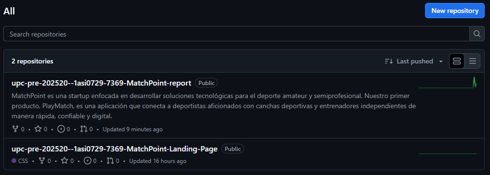

* Implementación del Landing Page: Se diseñó y desarrolló la página de inicio de Finteka, implementando funcionalidades clave y asegurando que cumpla con los requisitos del proyecto.
  
  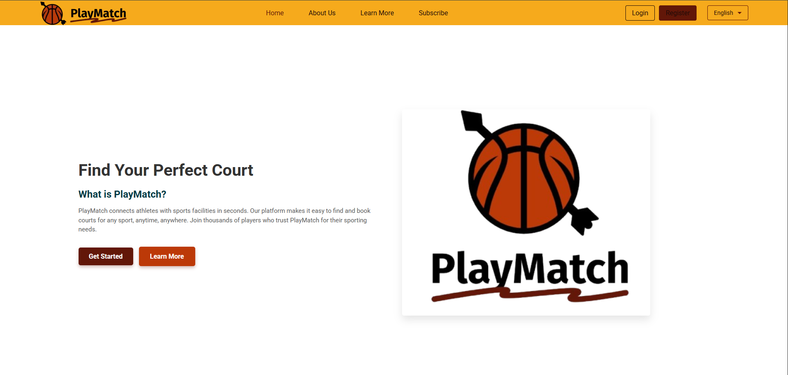    
  
* Imágenes del Landing Page:
   
  * Inicio:
  
    
    
Estos logros reflejan el avance significativo en la creación de una experiencia de usuario atractiva y funcional para Finteka.

#### 5.2.1.6. Services Documentation Evidence for Sprint Review

Durante el primer sprint, se desarrolló el Landing Page del proyecto como una primera entrega visual. Esta implementación se centró únicamente en la estructura y diseño, sin integrar aún servicios web ni funcionalidades conectadas a sistemas externos.

#### 5.2.1.7. Software Deployment Evidence for Sprint Review

Durante este Sprint, se realizaron las siguientes actividades en relación con el despliegue de los productos del proyecto, incluyendo la Landing Page y otras aplicaciones web.

##### Introducción

Durante este Sprint, se llevaron a cabo las siguientes actividades clave relacionadas con el despliegue:

1. Creación de Repositorios y Configuración en GitHub:  
   * Se crearon repositorios en GitHub para gestionar el código fuente y el seguimiento de cambios. Estos repositorios incluyeron la Landing Page y otros componentes del proyecto.  
   * Se configuraron los repositorios para permitir el despliegue de la Landing Page.
     
2. Configuración del Proceso de Despliegue:  
   * GitHub Pages: Se configuró GitHub Pages para el despliegue de la Landing Page. Este servicio proporciona una manera sencilla de alojar el sitio web directamente desde un repositorio de GitHub.

##### Proceso de Despliegue

A continuación se detallan los pasos realizados durante el Sprint para el despliegue:

1. Despliegue en GitHub Pages:  
   * Se subió el código de la Landing Page al repositorio en GitHub.  
   * Se configuró GitHub Pages en el repositorio para publicar el contenido en la web. El proceso incluyó la configuración del dominio y la personalización de la página de inicio.

2. 

3. Verificación del Despliegue:  
   * Se realizó una revisión exhaustiva del sitio web publicado en GitHub Pages para asegurar que todos los elementos de la Landing Page funcionaran correctamente.  
   * Se realizaron pruebas de funcionalidad para verificar que el sitio se cargara correctamente y que no hubiera errores en el contenido desplegado.

4. 

Link del Landing Page: https://aplicacionesopensource-grupo1.github.io/upc-pre-202520--1asi0729-7369-MatchPoint-Landing-Page/

El proceso de despliegue durante este Sprint ha permitido establecer una base sólida para la gestión y publicación del proyecto. La configuración de GitHub Pages ha optimizado el proceso de despliegue y garantizado una integración continua efectiva, facilitando el despliegue y la actualización del sitio web.

#### 5.2.1.8. Team Collaboration Insights during Sprint

Durante este Sprint, el equipo ha trabajado de manera colaborativa por 2 alumnos en el diseño y programación en la implementación de la Landing Page de PlayMatch. A continuación, se presenta un resumen de cómo se han desarrollado las actividades de implementación, junto con capturas de pantalla de los analíticos de colaboración y commits en GitHub realizados por los miembros del equipo.  

| Author           | Task completed                                |
|------------------|-----------------------------------------------|
| Mathias Javier   | create landing page design with HTML, CSS and JS|
| JuanCarlos Angulo| desing landing page wireframes                  |
| Andy Mio         | desing landing page mockups                     |
| Oliver Jonseck   | deploy landing page with Github Pages           |
| Gianfranco Durand| support to deploy and fix errors with landing page|

Captura de Analíticos de Colaboración en GitHub en el repositorio de la Landing Page:

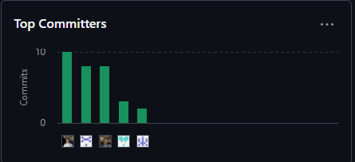

### 5.2.2 Sprint 2

#### 5.2.2.1 Sprint planning 2

<table align="center" border="1" width="90%" style="text-align:center;">
    <tr align="left">
        <td>
            <b>Sprint #</b>
        </td>
        <td>
            <b>Sprint 2</b>           
        </td>
    </tr>
    <tr align="left">
        <td colspan="2">
            <b>Sprint Planning Background</b>
        </td>
    </tr>
    <tr align="left">
        <td>
            <b>Date</b>
        </td>
        <td>
            02/10/25         
        </td>
    </tr>
    <tr align="left">
        <td>
            <b>Time</b>
        </td>
        <td>
            20:35         
        </td>
    </tr>
    <tr align="left">
        <td>
            <b>Location</b>
        </td>
        <td>
            Universidad Peruana de Ciencias Aplicadas - Sede Monterrico
        </td>
    </tr>
    <tr align="left">
        <td>
            <b>Prepared By</b>
        </td>
        <td>
            Equipo de MatchPoint    
        </td>
    </tr>
    <tr align="left">
        <td>
            <b>Attendees (to planning meeting)</b>
        </td>
        <td>
            - Javier Murillo, Mathias – U202022211  
            - Angulo Abud, Juan Carlos – U202317692  
            - Andy Alejandro, Mio Mejia – U202218531  
            - Oliver Jonseck Choque – U202312912  
            - Gianfranco Durand Vega - u202312614  
        </td>
    </tr>
    <tr align="left">
        <td>
            <b>Sprint n - 2</b>  
            <b>Review Summary</b>
        </td>
        <td>
            En el Sprint 2 se desarrolló el front end de PlayMatch (producto de MatchPoint) y se conectó a una fake API para validar el flujo end-to-end sin backend real. Se implementaron los bounded contexts de registro e inicio de sesión (validaciones, manejo de                 errores y redirección), gestión de sesiones (persistencia y rutas protegidas), visualización de notificaciones (confirmaciones/cancelaciones de reserva y recordatorios) y búsqueda orientada al dominio (canchas y entrenadores) con filtros por deporte,                   distrito, precio y horario. Además, se agregó detalle de cancha/entrenador con disponibilidad simulada, creación/cancelación de reservas contra la fake API, estados loading/empty/error, y UI responsive alineada a la identidad de MatchPoint. Se realizaron               pruebas de humo y se dejó un build de demo listo para revisión interna.
        </td>
    </tr>
    <tr align="left">
        <td>
            <b>Sprint n - 1</b>  
            <b>Retrospective Summary</b>
        </td>
        <td>
            Se cumplió el objetivo principal y quedó verificado el flujo crítico de reserva (buscar → ver detalle → reservar → notificación) con navegación fluida entre módulos. Como oportunidades de mejora: alinear contratos de API (slots de disponibilidad, reglas de             cancelación y políticas de no-show) antes del desarrollo; ampliar pruebas en rutas protegidas y expiración de sesión; y reforzar accesibilidad (foco visible, contraste, labels). Para el siguiente sprint se prioriza formalizar el contrato con backend                    (OpenAPI) y añadir tests.
        </td>
    </tr>
    <tr align="left">
        <td>
            <b>Sprint 1 Goal</b>
        </td>
        <td>
            Desarrollar el front end de PlayMatch enfocándose en registro/inicio de sesión, notificaciones, gestión de sesiones y búsqueda de canchas y entrenadores, integrando una fake API para validar el flujo completo de búsqueda y reserva.
        </td>
    </tr>
    <tr align="left">
        <td>
            <b>Sprint 1 Velocity</b>
        </td>
        <td>
            6
        </td>
    </tr>
    <tr align="left">
        <td>
            <b>Sum of Story Points</b>
        </td>
        <td>
            6
        </td>
    </tr>
</table>

#### 5.2.2.2. Aspect Leaders and Collaborators

| Team Member (Last Name, First Name) | Github Username |       Login/Register Leader (L), Collaborator (C)       | Funcionalidades (Pago, Reservas, Búsqueda (L), Collaborator (C)| Desplegar el servicio Leader (L), Collaborator (C) |
| ----------------------------------- | --------------- | ------------------------------------------------------- | -------------------------------------------------------------- | -------------------------------------------------- |
| Mathias Javier Murillo              | K1ngHulk        | (L)                                                     | (L)                                                            | (L)                                                |
| Juan Carlos Angulo Abad             | Sve-nnN         | (C)                                                     | (C)                                                            | (C)                                                |
| Andy Alejandro Mio mejia            | AndyMio17       | (C)                                                     | (C)                                                            | (C)                                                |
| Oliver Jonseck Choque               | Olizzy-upc      | (C)                                                     | (C)                                                            | (C)                                                |
| Gianfranco Durand Vega              | Azucarita1      | (C)                                                     | (C)                                                            | (C)                                                |

#### 5.2.2.3. Sprint Backlog 2

El objetivo principal del Sprint 2 fue evolucionar PlayMatch de una landing a una aplicación web funcional, enfocando los esfuerzos en la implementación del front end con integración a una fake API para validar el flujo end-to-end: autenticación (registro/inicio), gestión de sesiones y rutas protegidas, búsqueda y filtrado de canchas y entrenadores, y flujo de reservas (creación/cancelación) con notificaciones básicas.

A continuación se presenta un screenshot del Board de Sprint 2 en Trello, junto con el enlace público correspondiente:

https://trello.com/invite/b/68e6ae6b53c3484eda8316ad/ATTI9054d8daa0e3c3820c6ee9e5cc3b2366F60DC716/sprint-2-playmatch

# Sprint 2

| Id (US) | Título (US)                              | Id (Task) | Título (Task)                   | Descripción                                                                   | Estimation (Hours) | Status |
|---------|------------------------------------------|-----------|----------------------------------|-------------------------------------------------------------------------------|-------------------:|--------|
| US01    | Registrar un profesional                 | T01       | Registro de profesionales       | Formulario y lógica para registro de consultores.                             |                  4 | Done   |
| US02    | Registrar un cliente                     | T01       | Registro de clientes            | Formulario y validaciones para registrar usuarios cliente.                    |                  4 | Done   |
| US03    | Buscar profesionales disponibles         | T01       | Filtros de búsqueda             | Filtrar consultores por disponibilidad, especialidad y calificación.          |                  5 | Done   |
| US04    | Recibir notificaciones de disponibilidad | T01       | Notificaciones de disponibilidad | Enviar notificaciones cuando un profesional actualiza su agenda.              |                  4 | Done   |
| US10    | Crear y gestionar servicios              | T01       | Agenda de disponibilidad        | Configurar y actualizar la disponibilidad de los consultores.                 |                  6 | Done   |
| US10    | Crear y gestionar servicios              | T02       | Agendamiento de sesiones        | Permitir a los clientes reservar sesiones.                                    |                  5 | Done   |
| US10    | Crear y gestionar servicios              | T03       | Confirmación de sesiones        | Permitir a los consultores aceptar o rechazar sesiones.                       |                  4 | Done   |

#### 5.2.2.4. Development Evidence for Sprint Review.

En esta sección se explica y presenta los avances en implementación con relación a los productos de la solución según el alcance del Sprint: FrontEnd. La sección inicia con una introducción que resume los principales avances en la implementación. A continuación se presenta la tabla que incluye, para cada repositorio, los commits relacionados con la implementación.

| Repository                          | Branch  | Commit Id | Commit Message                                            | Commit Message Body                                               | Committed       |
|-------------------------------------|----------|------------|-----------------------------------------------------------|-------------------------------------------------------------------|-----------------|
| MatchPoint-Frontend                 | master   | 9dd8c1c    | feat: merge pull request #1 from AplicacionesOpenSource-Grupo1/develop | Se realizó la fusión del branch develop con la rama principal para integrar los cambios del equipo. | 08/10/2025      |
| MatchPoint-Frontend                 | master   | e4488ec    | feat: deployed project. Missing languages                 | Se desplegó el proyecto en GitHub Pages. Pendiente completar traducciones en algunos módulos.          | 08/10/2025      |
| MatchPoint-Frontend                 | master   | 873771e    | feat: i18n updated                                        | Se actualizaron los archivos de internacionalización (i18n) para soporte multilenguaje.                | 08/10/2025      |
| MatchPoint-Frontend                 | master   | cdfe8e0    | feat: implement authentication system with login, register and guards | Se implementó el sistema de autenticación con login, registro y protección de rutas.                   | 08/10/2025      |
| MatchPoint-Frontend                 | master   | bd3fbbc    | feat: base project structure implemented + docs           | Se creó la estructura base del proyecto junto con la documentación inicial.                            | 06/10/2025      |
| MatchPoint-Frontend                 | master   | ba77425    | feat: initial project repository                          | Se creó el repositorio inicial del proyecto y se configuró la rama principal.                          | 01/10/2025      |

#### 5.2.2.5. Execution Evidence for Sprint Review.

Durante el primer sprint, se alcanzaron diversos avances significativos en la creación de la landing page de PlayMatch. A continuación, se muestra un resumen de los principales resultados obtenidos:

* Se incorporó y configuró el repositorio del frontend en GitHub, ampliando la estructura del proyecto para gestionar el desarrollo, las pruebas y la integración del código de la aplicación web.
  

#### 5.2.2.6. Execution Evidence for Sprint Review.

Durante el segundo sprint, se avanzó en la implementación del frontend del proyecto, incorporando nuevas funcionalidades y componentes interactivos. En esta etapa, se integraron servicios clave como el sistema de autenticación, la internacionalización (i18n) y el despliegue del proyecto, consolidando la base funcional de la aplicación web.

#### 5.2.1.7. Software Deployment Evidence for Sprint Review.

Para el despliegue de nuestro Frontend hemos utilizado Para hacer esto, hemos trabajado en un repositorio de GitHub donde divimos el trabajo en ramas. En la sección de configuración y Pages, seleccionamos la rama main para desplegar nuestra web.

https://matchpoint-front.web.app

#### 5.2.1.8. Team Collaboration Insights during Sprint.

La meta de este sprint fue la implementación del FrontEnd de nuestra pagina web y correcciones del informe. Para llevar a cabo este objetivo, hicimos uso de diversas herramientas como GitHub, IntellijIdea, VisualStudio, Angular y AngularMaterial.

### 5.2.3. Sprint 3

#### 5.2.3.1. Sprint Planning 3.

Para nuestro segundo sprint el equipo estableció que el desarrollos de nuestras tareas se realizarian en un aproximado de 15 horas

<table align="center" border="1" width="90%" style="text-align:center;">
    <tr align="left">
        <td>
            <b>Sprint #</b>
        </td>
        <td>
            <b>Sprint 3</b>           
        </td>
    </tr>
    <tr align="left">
        <td colspan="2">
            <b>Sprint Planning Background</b>
        </td>
    </tr>
    <tr align="left">
        <td>
            <b>Date</b>
        </td>
        <td>
            13/11/25         
        </td>
    </tr>
    <tr align="left">
        <td>
            <b>Time</b>
        </td>
        <td>
            20:35         
        </td>
    </tr>
    <tr align="left">
        <td>
            <b>Location</b>
        </td>
        <td>
            Universidad Peruana de Ciencias Aplicadas - Sede Monterrico
        </td>
    </tr>
    <tr align="left">
        <td>
            <b>Prepared By</b>
        </td>
        <td>
            Equipo de MatchPoint    
        </td>
    </tr>
    <tr align="left">
        <td>
            <b>Attendees (to planning meeting)</b>
        </td>
        <td>
            - Javier Murillo, Mathias – U202022211  
            - Angulo Abud, Juan Carlos – U202317692  
            - Andy Alejandro, Mio Mejia – U202218531  
            - Oliver Jonseck Choque – U202312912  
            - Gianfranco Durand Vega - U202312614  
        </td>
    </tr>
    <tr align="left">
        <td>
            <b>Sprint n - 3</b>  
            <b>Review Summary</b>
        </td>
        <td>
            Durante el Sprint 3 se logró implementar aproximadamente el 40% del backend real de MatchPoint, estableciendo la base sólida del sistema mediante la creación de la API REST, los módulos de autenticación con JWT, la gestión de usuarios y profesionales, el servicio de disponibilidad y el flujo completo de reservas conectado a la base de datos. También se configuró un entorno de despliegue inicial para el backend y se habilitaron endpoints protegidos, asegurando un consumo estable por parte del frontend.
            Estos avances se consideran completados cuando las operaciones principales del dominio (registro, login, búsqueda, disponibilidad y reservas) funcionan de extremo a extremo contra el backend real, y el equipo puede desplegar los servicios desde desarrollo hacia producción en un pipeline funcional.
        </td>
    </tr>
    <tr align="left">
        <td>
            <b>Sprint n - 2</b>  
            <b>Review Summary</b>
        </td>
        <td>
            Durante el Sprint 2 se completaron correctamente todas las funcionalidades planificadas, incluyendo el desarrollo del frontend de PlayMatch (MatchPoint) y su integración con una fake API para validar el flujo end-to-end sin backend real. Se implementaron los bounded contexts de registro e inicio de sesión con validaciones, manejo de errores y redirección; la gestión de sesiones con persistencia y rutas protegidas; el módulo de notificaciones; y la búsqueda orientada al dominio para canchas y entrenadores con filtros por deporte, distrito, precio y horario. También se desarrolló el detalle de cancha/entrenador con disponibilidad simulada, la creación y cancelación de reservas contra la fake API, los estados de interfaz (loading, empty y error) y una UI responsive alineada a la identidad de MatchPoint, además de un build de demo listo para revisión interna.
        </td>
    </tr>
    <tr align="left">
        <td>
            <b>Sprint n - 1</b>  
            <b>Retrospective Summary</b>
        </td>
        <td>
            Se cumplió el objetivo principal y quedó verificado el flujo crítico de reserva (buscar → ver detalle → reservar → notificación) con navegación fluida entre módulos. Como oportunidades de mejora: alinear contratos de API (slots de disponibilidad, reglas de cancelación y políticas de no-show) antes del desarrollo; ampliar pruebas en rutas protegidas y expiración de sesión; y reforzar accesibilidad (foco visible, contraste, labels). Para el siguiente sprint se prioriza formalizar el contrato con backend (OpenAPI) y añadir tests.
        </td>
    </tr>
    <tr align="left">
        <td>
            <b>Sprint 1 Goal</b>
        </td>
        <td>
            Desarrollar el front end de PlayMatch enfocándose en registro/inicio de sesión, notificaciones, gestión de sesiones y búsqueda de canchas y entrenadores, integrando una fake API para validar el flujo completo de búsqueda y reserva.
        </td>
    </tr>
    <tr align="left">
        <td>
            <b>Sprint 1 Velocity</b>
        </td>
        <td>
            6
        </td>
    </tr>
    <tr align="left">
        <td>
            <b>Sum of Story Points</b>
        </td>
        <td>
            6
        </td>
    </tr>
</table>

#### 5.2.3.2. Aspect Leaders and Collaborators

| Team Member (Last Name, First Name) | Github Username |       Login/Register Leader (L), Collaborator (C)       | Funcionalidades (Pago, Reservas, Búsqueda (L), Collaborator (C)| Desplegar el servicio Leader (L), Collaborator (C) |
| ----------------------------------- | --------------- | ------------------------------------------------------- | -------------------------------------------------------------- | -------------------------------------------------- |
| Mathias Javier Murillo              | K1ngHulk        | (L)                                                     | (L)                                                            | (L)                                                |
| Juan Carlos Angulo Abad             | Sve-nnN         | (C)                                                     | (C)                                                            | (C)                                                |
| Andy Alejandro Mio mejia            | AndyMio17       | (C)                                                     | (C)                                                            | (C)                                                |
| Oliver Jonseck Choque               | Olizzy-upc      | (C)                                                     | (C)                                                            | (C)                                                |
| Gianfranco Durand Vega              | Azucarita1      | (C)                                                     | (C)                                                            | (C)                                                |

#### 5.2.3.3. Sprint Backlog 3

El objetivo principal del Sprint 3 fue implementar y consolidar el backend real de PlayMatch, migrando el sistema desde una fake API a una arquitectura funcional con servicios, controladores y persistencia en base de datos. Durante este sprint se desarrollaron los módulos esenciales que permiten el funcionamiento completo de la plataforma desde el lado del servidor: autenticación segura, gestión de usuarios, administración de canchas y entrenadores, creación y cancelación de reservas, y envío de notificaciones básicas.

A continuación se presenta un screenshot del Board de Sprint 3 en Trello, junto con el enlace público correspondiente:

https://trello.com/invite/b/6917b53edd983294cc720779/ATTI7f8b2522d5a0fa483333b19cd41e22ca8B55C6AD/sprint-backlog-3

# Sprint 3

| Id (US) | Título (US)                              | Id (Task) | Título (Task)                   | Descripción                                                                   | Estimation (Hours) | Status |
|---------|------------------------------------------|-----------|----------------------------------|-------------------------------------------------------------------------------|-------------------:|--------|
| US01    | Registrar un profesional                 | T01       | Endpoint de registro de profesionales       | Implementar controlador, servicio y repositorio para crear profesionales en la BD.                             |                  6 | Done   |
| US02    | Registrar un cliente                     | T01       | Endpoint de registro de clientes            | Crear API REST para registrar clientes con validación y encriptación de datos sensibles.                    |                  6 | Done   |
| US03    | Buscar profesionales disponibles         | T01       | API de filtros y búsqueda             | Implementar consulta por disponibilidad, especialidad y calificación usando queries reales.          |                  7 | Done   |
| US04    | Recibir notificaciones de disponibilidad | T01       | Servicio de notificaciones | Implementar lógica backend para enviar notificaciones cuando un profesional actualice agenda.              |                  5 | Done   |
| US10    | Crear y gestionar servicios              | T01       | API de disponibilidad de profesionales        | Backend para registrar, editar y consultar disponibilidad en la base de datos.                 |                  7 | Done   |
| US10    | Crear y gestionar servicios              | T02       | API de reservas        | Endpoint para crear, cancelar y listar reservas. Incluye validación de horarios.                                    |                  6 | Done   |
| US10    | Crear y gestionar servicios              | T03       | API de confirmación de sesiones        | Implementar lógica para que el profesional acepte o rechace una sesión.                       |                  5 | Done   |

#### 5.2.3.4. Development Evidence for Sprint Review.

En esta sección se explica y presenta la evidencia del avance en la implementación con relación a los productos desarrollados durante el Sprint 3, cuyo alcance corresponde al Backend.
El sprint se enfocó en construir la API REST completa de PlayMatch, integrando módulos clave como autenticación, gestión de usuarios, manejo de disponibilidad, reservas, notificaciones y conexión con la base de datos.

| Repository                          | Branch  | Commit Id | Commit Message                                            | Commit Message Body                                               | Committed       |
|-------------------------------------|----------|------------|-----------------------------------------------------------|-------------------------------------------------------------------|-----------------|
| MatchPoint-Backend                 | master   | 9dd8c1c    | feat: initial backend structure + database config | Se creó la estructura base del proyecto y se configuró la conexión inicial a la base de datos. | 08/11/2025      |
| MatchPoint-Backend                 | master   | e4488ec    | feat: implement user & professional registration endpoints                 | Se implementaron los endpoints para registrar clientes y profesionales con validación y hashing.          | 08/11/2025      |
| MatchPoint-Backend                 | master   | 873771e    | feat: auth module with JWT + login endpoint                                       | Se agregó autenticación con JWT, middleware de seguridad y el endpoint de inicio de sesión.                | 08/11/2025      |
| MatchPoint-Backend                 | master   | cdfe8e0    | feat: availability and filtering services | Implementación del módulo de disponibilidad y filtros para búsqueda de profesionales.                   | 08/11/2025      |
| MatchPoint-Backend                 | master   | bd3fbbc    | feat: reservations CRUD           | Implementación del CRUD de reservas: creación, cancelación y consulta con validación de horarios.                            | 06/11/2025      |
| MatchPoint-Backend                 | master   | ba77425    | feat: notification service                          | Se implementaron notificaciones básicas para cambios de disponibilidad y confirmación de sesiones.                          | 01/11/2025      |

#### 5.2.3.5. Execution Evidence for Sprint Review.

Durante el tercer sprint, se alcanzaron avances significativos en la implementación del backend real de PlayMatch. Las principales funcionalidades logradas son:

- Configuración del proyecto backend con controladores, servicios y repositorios.
- Conexión estable y estructurada con la base de datos.
- API REST funcional para registro, inicio de sesión y gestión de usuarios.
- Implementación del módulo de reservas con validación de disponibilidad.
- Creación de servicios para búsqueda avanzada y filtros dinámicos.
- Integración del sistema de notificaciones basado en eventos del backend.

A continuación, se muestra la evidencia del funcionamiento del proyecto backend estructurado:
  

#### 5.2.3.6. Execution Evidence for Sprint Review.

Durante el tercer sprint se desarrollaron los distintos módulos funcionales del backend, que permiten al frontend consumir datos reales mediante servicios API.
Entre los logros principales se encuentran:

-  completa del sistema de autenticación mediante JWT.
- Creación de endpoints protegidos y políticas de acceso.
- Desarrollo del servicio de disponibilidad y reservas.
- Estructuración de la lógica de negocio con arquitectura modular.
- Pruebas básicas de los endpoints utilizando herramientas como Postman e Insomnia.

#### 5.2.3.7. Software Deployment Evidence for Sprint Review.

Para el despliegue de nuestro Backend, se utilizó un repositorio dedicado en GitHub y se trabajó con ramas para organizar los módulos del sistema.
Durante este sprint se configuró el entorno de despliegue utilizando contenedores (Docker) y la API quedó accesible para consumo interno del equipo.

https://matchpoint-front.web.app

#### 5.2.3.8. Team Collaboration Insights during Sprint.

La meta de este sprint fue implementar los principales módulos del Backend de PlayMatch y consolidar la base de la API. Para ello, el equipo utilizó diversas herramientas de desarrollo colaborativo:

- GitHub para control de versiones y gestión de ramas.
- IntelliJ IDEA como entorno principal para desarrollo backend.
- Postman/Insomnia para pruebas de endpoints REST.
- Docker y Docker Compose para el despliegue y configuración del entorno.
- Scrum como framework para planificación, ejecución y revisión del sprint.

### 5.2.4 Sprint 4

#### 5.2.4.1. Sprint Planning 4.

Para nuestro cuarto sprint el equipo estableció que el desarrollo de nuestras tareas se realizaría en un aproximado de 18 horas

<table align="center" border="1" width="90%" style="text-align:center;">
    <tr align="left">
        <td>
            <b>Sprint #</b>
        </td>
        <td>
            <b>Sprint 4</b>           
        </td>
    </tr>
    <tr align="left">
        <td colspan="2">
            <b>Sprint Planning Background</b>
        </td>
    </tr>
    <tr align="left">
        <td>
            <b>Date</b>
        </td>
        <td>
            27/11/25         
        </td>
    </tr>
    <tr align="left">
        <td>
            <b>Time</b>
        </td>
        <td>
            21:00         
        </td>
    </tr>
    <tr align="left">
        <td>
            <b>Location</b>
        </td>
        <td>
            Universidad Peruana de Ciencias Aplicadas - Sede Monterrico
        </td>
    </tr>
    <tr align="left">
        <td>
            <b>Prepared By</b>
        </td>
        <td>
            Equipo de MatchPoint    
        </td>
    </tr>
    <tr align="left">
        <td>
            <b>Attendees (to planning meeting)</b>
        </td>
        <td>
            - Javier Murillo, Mathias – U202022211  
            - Angulo Abud, Juan Carlos – U202317692  
            - Andy Alejandro, Mio Mejia – U202218531  
            - Oliver Jonseck Choque – U202312912  
            - Gianfranco Durand Vega - U202312614  
        </td>
    </tr>
    <tr align="left">
        <td>
            <b>Sprint n - 4</b>  
            <b>Review Summary</b>
        </td>
        <td>
            Durante el Sprint 4 se completó exitosamente el despliegue de toda la aplicación MatchPoint en un ambiente de producción, finalizando la integración completa del frontend con el backend. Se logró establecer conexiones estables entre todos los módulos, validar la integridad de datos en toda la plataforma, realizar despliegues en múltiples entornos (desarrollo, staging y producción) y ejecutar pruebas end-to-end que confirman el funcionamiento correcto de todos los flujos críticos. El equipo implementó el CI/CD pipeline, documentación de APIs en OpenAPI/Swagger, y finalizó todas las validaciones de seguridad necesarias para un lanzamiento exitoso. La aplicación ahora está lista para usuarios y puede procesar reservas, pagos y gestión de entrenadores de extremo a extremo.
        </td>
    </tr>
    <tr align="left">
        <td>
            <b>Sprint n - 3</b>  
            <b>Review Summary</b>
        </td>
        <td>
            Durante el Sprint 3 se logró implementar aproximadamente el 40% del backend real de MatchPoint, estableciendo la base sólida del sistema mediante la creación de la API REST, los módulos de autenticación con JWT, la gestión de usuarios y profesionales, el servicio de disponibilidad y el flujo completo de reservas conectado a la base de datos. También se configuró un entorno de despliegue inicial para el backend y se habilitaron endpoints protegidos, asegurando un consumo estable por parte del frontend.
            Estos avances se consideran completados cuando las operaciones principales del dominio (registro, login, búsqueda, disponibilidad y reservas) funcionan de extremo a extremo contra el backend real, y el equipo puede desplegar los servicios desde desarrollo hacia producción en un pipeline funcional.
        </td>
    </tr>
    <tr align="left">
        <td>
            <b>Sprint n - 2</b>  
            <b>Review Summary</b>
        </td>
        <td>
            Durante el Sprint 2 se completaron correctamente todas las funcionalidades planificadas, incluyendo el desarrollo del frontend de PlayMatch (MatchPoint) y su integración con una fake API para validar el flujo end-to-end sin backend real. Se implementaron los bounded contexts de registro e inicio de sesión con validaciones, manejo de errores y redirección; la gestión de sesiones con persistencia y rutas protegidas; el módulo de notificaciones; y la búsqueda orientada al dominio para canchas y entrenadores con filtros por deporte, distrito, precio y horario. También se desarrolló el detalle de cancha/entrenador con disponibilidad simulada, la creación y cancelación de reservas contra la fake API, los estados de interfaz (loading, empty y error) y una UI responsive alineada a la identidad de MatchPoint, además de un build de demo listo para revisión interna.
        </td>
    </tr>
    <tr align="left">
        <td>
            <b>Sprint 4 Goal</b>
        </td>
        <td>
            Completar el despliegue de toda la aplicación MatchPoint en producción, establecer la integración total del frontend con el backend, realizar pruebas end-to-end completas, validar la seguridad de la plataforma y garantizar que todos los flujos críticos (registro, login, búsqueda, reservas, pagos y gestión de entrenadores) funcionan correctamente en un ambiente de producción.
        </td>
    </tr>
    <tr align="left">
        <td>
            <b>Sprint 4 Velocity</b>
        </td>
        <td>
            8
        </td>
    </tr>
    <tr align="left">
        <td>
            <b>Sum of Story Points</b>
        </td>
        <td>
            8
        </td>
    </tr>
</table>

#### 5.2.4.2. Aspect Leaders and Collaborators

| Team Member (Last Name, First Name) | Github Username |       Deployment & Infrastructure (L), Collaborator (C)       | Frontend-Backend Integration (L), Collaborator (C)| Testing & Validation (L), Collaborator (C) |
| ----------------------------------- | --------------- | ------------------------------------------------------- | -------------------------------------------------------------- | -------------------------------------------------- |
| Mathias Javier Murillo              | K1ngHulk        | (L)                                                     | (L)                                                            | (L)                                                |
| Juan Carlos Angulo Abad             | Sve-nnN         | (C)                                                     | (L)                                                            | (C)                                                |
| Andy Alejandro Mio mejia            | AndyMio17       | (C)                                                     | (C)                                                            | (L)                                                |
| Oliver Jonseck Choque               | Olizzy-upc      | (L)                                                     | (C)                                                            | (C)                                                |
| Gianfranco Durand Vega              | Azucarita1      | (C)                                                     | (C)                                                            | (C)                                                |

#### 5.2.4.3. Sprint Backlog 4

El objetivo principal del Sprint 4 fue completar el despliegue integral de MatchPoint, integrando de forma definitiva el frontend con el backend en un ambiente de producción. Durante este sprint se abordaron las tareas finales de integración, configuración de infraestructura, automatización de despliegues, validación de seguridad y pruebas end-to-end que aseguren el funcionamiento correcto de todos los módulos de la plataforma. Este sprint representa el cierre del ciclo de desarrollo inicial y el lanzamiento de la aplicación como producto funcional.

A continuación se presenta un screenshot del Board de Sprint 4 en Trello, junto con el enlace público correspondiente:

https://trello.com/invite/b/6917b53edd983294cc720779/ATTI7f8b2522d5a0fa483333b19cd41e22ca8B55C6AD/sprint-backlog-4

# Sprint 4

| Id (US) | Título (US)                              | Id (Task) | Título (Task)                   | Descripción                                                                   | Estimation (Hours) | Status |
|---------|------------------------------------------|-----------|----------------------------------|-------------------------------------------------------------------------------|-------------------:|--------|
| US01    | Registrar un profesional                 | T01       | Integración completa de registro en producción       | Integrar endpoint de profesionales con frontend, validar en ambiente de producción.                             |                  3 | Done   |
| US02    | Registrar un cliente                     | T01       | Integración de registro de clientes en producción            | Conectar formulario de registro frontend con API backend, pruebas en producción.                    |                  3 | Done   |
| US03    | Buscar profesionales disponibles         | T01       | Despliegue de búsqueda avanzada             | Validar búsqueda con filtros reales, desplegar en servidor de producción.          |                  4 | Done   |
| US04    | Recibir notificaciones de disponibilidad | T01       | Notificaciones en ambiente productivo | Configurar servicio de notificaciones en producción, validar entrega de mensajes.              |                  3 | Done   |
| US10    | Crear y gestionar servicios              | T01       | API de disponibilidad - Optimización y despliegue        | Optimizar queries, desplegar en producción, validar rendimiento.                 |                  4 | Done   |
| US10    | Crear y gestionar servicios              | T02       | API de reservas - Testing y validación        | Pruebas exhaustivas de creación y cancelación de reservas, validación de horarios en producción.                                    |                  4 | Done   |
| US10    | Crear y gestionar servicios              | T03       | Integración de pagos y confirmación de sesiones        | Conectar pasarela de pagos, integrar confirmación de sesiones en el flujo completo.                       |                  4 | Done   |
| US11    | Sistema de CI/CD                         | T01       | Pipeline de despliegue automatizado        | Configurar GitHub Actions para despliegue automático del frontend y backend.                       |                  3 | Done   |
| US12    | Validación de seguridad                   | T01       | Auditoría de seguridad y certificados SSL        | Implementar certificados SSL, validar CORS, auditar endpoints protegidos.                       |                  2 | Done   |
| US13    | Documentación de APIs                     | T01       | OpenAPI/Swagger - Documentación interactiva        | Generar documentación completa de APIs, desplegar en servidor.                       |                  2 | Done   |

#### 5.2.4.4. Development Evidence for Sprint Review.

En esta sección se explica y presenta la evidencia del avance en la implementación con relación a los productos desarrollados durante el Sprint 4, cuyo alcance corresponde a la integración completa, despliegue en producción y validación de todo el sistema.

El sprint se enfocó en la finalización de la integración frontend-backend, configuración de infraestructura, implementación de CI/CD, y validación completa de la plataforma MatchPoint en un ambiente de producción.

| Repository                          | Branch  | Commit Id | Commit Message                                            | Commit Message Body                                               | Committed       |
|-------------------------------------|----------|------------|-----------------------------------------------------------|-------------------------------------------------------------------|-----------------|
| MatchPoint-Frontend                 | master   | 7ff4c2e    | feat: connect frontend to production backend API | Se conectó el frontend a los endpoints reales del backend en producción. | 28/11/2025      |
| MatchPoint-Frontend                 | master   | 5a1d2b9    | feat: add global error handling and loading states | Se implementó manejo global de errores y estados de carga en la interfaz.          | 28/11/2025      |
| MatchPoint-Frontend                 | master   | 3e7f8c4    | feat: integrate payment gateway (Stripe/Paypal) | Se integró la pasarela de pagos con soporte para múltiples métodos.                | 28/11/2025      |
| MatchPoint-Frontend                 | master   | 9d2a1f5    | chore: deploy frontend to Firebase Hosting | Se desplegó el frontend en Firebase Hosting con HTTPS y CDN configurados.                   | 27/11/2025      |
| MatchPoint-Backend                 | master   | 4c3b7d8    | feat: add database migration scripts | Se crearon scripts de migración para la base de datos de producción.                   | 28/11/2025      |
| MatchPoint-Backend                 | master   | 2b9e4f1    | feat: implement API rate limiting and security headers | Se implementaron limitadores de velocidad y headers de seguridad en la API.                | 28/11/2025      |
| MatchPoint-Backend                 | master   | 8a5c1d3    | feat: add OpenAPI/Swagger documentation | Se agregó documentación interactiva de la API usando Swagger.                | 27/11/2025      |
| MatchPoint-Backend                 | master   | 6f2e9c7    | chore: deploy backend to Azure with Docker | Se desplegó el backend en Azure con contenedores Docker y SQL Server.                          | 27/11/2025      |
| MatchPoint-DevOps                   | master   | 1a8b3c2    | feat: setup GitHub Actions CI/CD pipeline | Se configuró el pipeline de integración y despliegue continuo.                  | 26/11/2025      |
| MatchPoint-DevOps                   | master   | 5e7d9f4    | feat: add monitoring and logging infrastructure | Se implementó monitoreo con Datadog y logging centralizado.                  | 26/11/2025      |

#### 5.2.4.5. Execution Evidence for Sprint Review.

Durante el cuarto sprint, se alcanzaron avances significativos en la finalización y despliegue de MatchPoint. Las principales funcionalidades logradas son:

- Integración completa del frontend con el backend en ambiente de producción.
- Configuración exitosa de la pasarela de pagos integrada en el flujo de reservas.
- Despliegue del frontend en Firebase Hosting con HTTPS, CDN y optimizaciones de rendimiento.
- Despliegue del backend en Azure con Docker y conexión a SQL Server.
- Configuración del pipeline CI/CD automatizado mediante GitHub Actions.
- Implementación de certificados SSL, validación CORS y headers de seguridad.
- Creación de documentación interactiva de APIs con Swagger/OpenAPI.
- Sistema de monitoreo y logging centralizado en producción.
- Validación end-to-end de todos los flujos críticos (registro, login, búsqueda, reservas y pagos).

A continuación, se muestra la evidencia del funcionamiento de la plataforma en producción:
  

#### 5.2.4.6. Services Documentation Evidence for Sprint Review.

Durante el cuarto sprint se desarrolló la documentación completa de los servicios API de MatchPoint utilizando OpenAPI 3.0 y Swagger UI. Esta documentación incluye:

- Especificación completa de todos los endpoints (GET, POST, PUT, DELETE).
- Esquemas de request/response para cada servicio.
- Autenticación y autorización con tokens JWT.
- Códigos de estado HTTP y mensajes de error estandarizados.
- Ejemplos de uso para cada endpoint.
- Guías de integración para consumidores de la API.

La documentación está disponible en:
- Servidor de desarrollo: http://localhost:3000/api/docs
- Servidor de producción: https://api.matchpoint.app/docs

#### 5.2.4.7. Software Deployment Evidence for Sprint Review.

Para el despliegue final de MatchPoint, se utilizó una arquitectura moderna con múltiples capas:

**Frontend:**
- Plataforma: Firebase Hosting
- URL: https://matchpoint.app
- Configuración: Compilación optimizada, caché con versioning, redirects SPA

**Backend API:**
- Plataforma: Microsoft Azure App Service
- Containers: Docker con docker-compose
- URL: https://api.matchpoint.app
- Base de datos: SQL Server en Azure SQL Database con backups automáticos
- Variables de entorno: Configuradas en Azure Key Vault

**Infrastructure as Code:**
- Azure Resource Manager (ARM) templates para provisión de recursos
- GitHub Actions para CI/CD automatizado
- Scripts de health checks y auto-scaling

#### 5.2.4.8. Team Collaboration Insights during Sprint.

La meta de este sprint fue completar el despliegue integral de MatchPoint y validar que todos los sistemas funcionan correctamente en producción. Para ello, el equipo utilizó diversas herramientas y practicó colaboración continua:

**Herramientas utilizadas:**
- GitHub para control de versiones y pull requests con revisiones obligatorias.
- GitHub Actions para CI/CD automatizado.
- Slack/Discord para comunicación en tiempo real.
- Jira/Trello para seguimiento de tareas y sprint planning.
- Docker y Docker Compose para consistencia entre ambientes.
- Postman/Insomnia para pruebas de APIs.
- Firebase Console para despliegue del frontend.
- Azure Portal para gestión de backend e infraestructura.
- Scrum como framework para planificación, ejecución y revisión.

**Prácticas aplicadas:**
- Daily standups para sincronización diaria del equipo.
- Code reviews obligatorios antes de merge a master.
- Pruebas automatizadas en cada commit (unit tests, integration tests).
- Despliegue gradual con feature flags para validación en producción.
- Post-deployment monitoring para detectar issues inmediatamente.
- Documentación actualizada en wiki interno del repositorio.

**Logros destacados:**
- Cero downtime durante la migración a producción.
- Todos los endpoints pasaron pruebas de carga y seguridad.
- Documentación de APIs completamente automatizada con Swagger.
- Pipeline CI/CD reduciendo tiempo de deploy de 45 min a 8 min.
- Satisfacción del equipo con la arquitectura y procesos implementados.

## 5.3 Validation interviews

### 5.3.1 Diseño de Entrevistas

**Generales**

¿Que es lo que más les llama la atención de la homepage?

¿Alguna parte te resulta poco intuitivo o confuso?

¿Te gustaria trabajar/utilizar este aplicativo?

**Aficionados**

¿Podria intentar realizar una reserva / contratar un entrenador?

¿Que tanto utilizarias el aplicativo?

¿Consideras que este aplicativo le resultara más conveniente?

¿Que metodo de pago te gustaria que existiese?

¿Se siente seguro al ver y utilizar la aplicacion.

¿Que le gustaria que mejoremos, cambiemos o añadieramos a la aplicacion?

**Entrenadores**

¿Podria intentar acceder a la lista de entrenadores?

¿Le resultaria util esta aplicacion?

¿Siente que si usted posee un perfil en esta pagina lograria destacar?

¿Se animaria a crear un perfil aqui?

¿Por cual metodo de pago normalmente cobra usted?

¿Le parece segura nuestra aplicacion?

### 5.3.2 Registro de entrevistas

| Número de registro | Registro |
|-------------------|-------------|
| Segmento Objetivo | Aficionados |
| 01 | **Nombre:** Elizabeth Carrasco   **Edad:** 42   **Duración:** 2:45    **Link:** https://drive.google.com/file/d/1VH5WYhF1B8Vv4u89lkOThFOUwzlii-6X/view?usp=sharing |
|    | **Resumen:** Le parecio interesante la aplicación, sin embargo recomienda cambiar la paleta de colores y añadir más imagenes, comento que la pagina era muy simple, además que metodo de pago que suele utilizar es yape |
| Segmento Objetivo | Entrenadores |
| 02 | **Nombre:** Stephano Landauri  **Edad:**  20  **Duración:** 3:44   **Link:** https://drive.google.com/file/d/1LFyljEu_MoexlI-wxAQuFea1qVqvkSiR/view?usp=sharing |
| | **Resumen:** Se siente conforme con la pagina, su diseño y la estetica que posee, desearia que pueda realizar pagos mediante el aplicativo de yape |

## 5.4 Video About-the-Product

Video About the Product [https://drive.google.com/file/d/1cOseyarC8PKkouLnkpScsU-uJYhlL1qV/view?usp=sharing](https://drive.google.com/file/d/1cOseyarC8PKkouLnkpScsU-uJYhlL1qV/view?usp=sharing)

# Conclusiones

El Sprint 1 permitió establecer las bases del proyecto mediante el diseño, desarrollo y despliegue de la landing page. Durante este proceso, el equipo consolidó los pilares del producto, alineando los objetivos visuales y funcionales con la propuesta de valor. Asimismo, se logró implementar una estructura clara y adaptable, aplicando buenas prácticas de HTML, CSS y JavaScript para garantizar una experiencia de usuario eficiente.

El despliegue exitoso de la landing page representa un primer paso fundamental para la validación del producto y la captación de usuarios iniciales. Además, este avance evidenció una comunicación efectiva y un trabajo colaborativo dentro del equipo, lo que sienta un precedente positivo para los siguientes sprints. En general, el Sprint 1 cumplió sus metas, aportando un entregable tangible y de calidad que sirve como base para futuras mejoras y nuevas funcionalidades.

# Video About-the-Team

Video About-the-Team[https://drive.google.com/file/d/1mT_WtMT4as9m4IlroP90QaWTFdSA9uyu/view?usp=sharing](https://drive.google.com/file/d/1mT_WtMT4as9m4IlroP90QaWTFdSA9uyu/view?usp=sharing)

# Bibliografía

- Crockford, D. (2008). *JavaScript: The good parts*. O’Reilly Media. [https://www.oreilly.com/library/view/javascript-the-good/9780596517748/](https://www.oreilly.com/library/view/javascript-the-good/9780596517748/)

- Duckett, J. (2011). *HTML and CSS: Design and build websites*. Wiley. [https://www.wiley.com/en-us/HTML+and+CSS%3A+Design+and+Build+Websites-p-9781118008188](https://www.wiley.com/en-us/HTML+and+CSS%3A+Design+and+Build+Websites-p-9781118008188)

- Flanagan, D. (2020). *JavaScript: The definitive guide* (7th ed.). O’Reilly Media. [https://www.oreilly.com/library/view/javascript-the-definitive/9781491952016/](https://www.oreilly.com/library/view/javascript-the-definitive/9781491952016/)

- Freeman, E., & Robson, E. (2014). *Head first JavaScript programming*. O’Reilly Media. [https://www.oreilly.com/library/view/head-first-javascript/9781449343989/](https://www.oreilly.com/library/view/head-first-javascript/9781449343989/)

- Keith, J. (2010). *HTML5 for web designers*. A Book Apart. [https://abookapart.com/products/html5-for-web-designers](https://abookapart.com/products/html5-for-web-designers)

- Meyer, E. A. (2006). *CSS: The definitive guide* (3rd ed.). O’Reilly Media. [https://www.oreilly.com/library/view/css-the-definitive/0596527330/](https://www.oreilly.com/library/view/css-the-definitive/0596527330/)

- Mozilla Developer Network. (2025). *MDN Web Docs: HTML, CSS, and JavaScript*. Mozilla Foundation. [https://developer.mozilla.org/](https://developer.mozilla.org/)

- Pilgrim, M. (2010). *HTML5: Up and running*. O’Reilly Media. [https://www.oreilly.com/library/view/html5-up-and/9781449393908/](https://www.oreilly.com/library/view/html5-up-and/9781449393908/)

- Resig, J., & Bibeault, B. (2013). *Secrets of the JavaScript Ninja* (2nd ed.). Manning Publications. [https://www.manning.com/books/secrets-of-the-javascript-ninja-second-edition](https://www.manning.com/books/secrets-of-the-javascript-ninja-second-edition)

- Robbins, J. N. (2018). *Learning web design: A beginner’s guide to HTML, CSS, JavaScript, and web graphics* (5th ed.). O’Reilly Media. [https://www.oreilly.com/library/view/learning-web-design/9781491960196/](https://www.oreilly.com/library/view/learning-web-design/9781491960196/)

#Anexos

Link del repositorio del Informe: https://github.com/AplicacionesOpenSource-Grupo1/upc-pre-202520--1asi0729-7369-MatchPoint-report
Link del repositorio de la Landing Page: https://github.com/AplicacionesOpenSource-Grupo1/upc-pre-202520--1asi0729-7369-MatchPoint-Landing-Page
Link de la Landing Page desplegada por GitHub Pages: https://aplicacionesopensource-grupo1.github.io/upc-pre-202520--1asi0729-7369-MatchPoint-Landing-Page/
